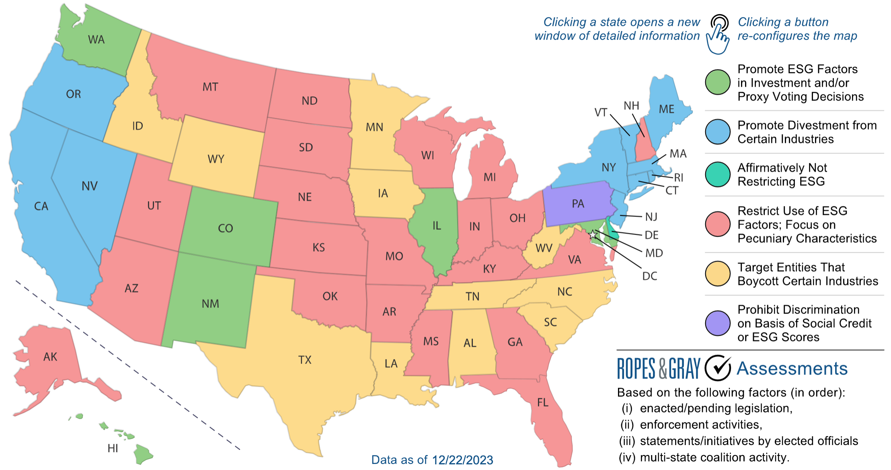
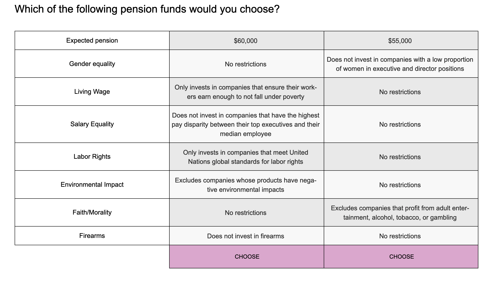
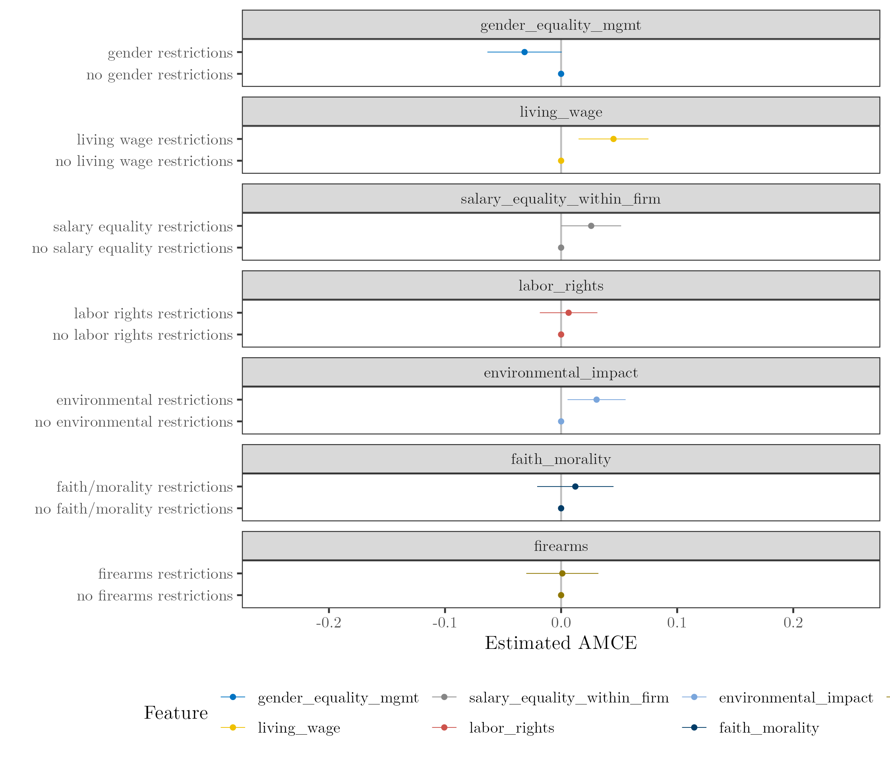

```{r include=FALSE}
library(tidyverse)

```

# Introduction

In recent years, Environmental, Social, and Governance (ESG) investing has emerged as a pivotal aspect of modern financial management, sparking debates that straddle the domains of economics, ethics, and politics. ESG investing, fundamentally, involves the integration of environmental, social, and governance considerations into investment decisions, a practice born from the growing recognition of how these factors can significantly impact financial performance and societal wellbeing [see, e.g., @edmans2023]. With trillions of dollars under management globally, ESG investments have become a major force in the financial world, reshaping how institutions and individuals approach investing.

The ascent of ESG investing has not been without controversy. The concept has become highly politicized, with entities like BlackRock and other major financial players finding themselves at the center of a heated debate [@moynihan2022]. This politicization is vividly reflected in the legislative actions taken by several U.S. states regarding the management of their state pension funds. These legislative efforts are split along ideological lines, with some states endorsing ESG investments under the belief that they align with the preferences and best interests of their constituents, while others vehemently oppose such strategies, arguing that they represent a breach of the fund managers' duty of loyalty to their beneficiaries.

This dichotomy raises an essential but underexplored question: How representative is the ESG-related legislation of the actual preferences and interests of the stakeholders in these state pension funds? Despite the growing body of literature on ESG investing, there exists a notable gap in empirical evidence regarding the representativeness of such legislative actions. This article aims to address this shortfall by juxtaposing these legislative trends against the actual preferences and interests of the stakeholders involved. Through this examination, the paper endeavors to shed light on the alignment---or lack thereof---between political actions and constituent interests in the arena of ESG investing, offering insights that are crucial for policymakers, investors, and scholars in understanding the complex interplay between finance, governance, and societal values.

In pursuit of a comprehensive understanding of the alignment between ESG-related legislative actions and stakeholder preferences, this study employs a powerful research methodology: conjoint analysis. This innovative approach allows us to delve deep into the stakeholders' preferences regarding pension fund investment strategies. Participants in this study engaged in a series of forced-choice decisions, where they had to choose one of different investment options, each characterized by unique attributes related to financial returns and ESG considerations. The methodology's advantage lies in its ability to simulate real-world trade-offs, decomposing the value of complex products with several attributes, and minimize social desirability bias [@bansak2021]. Two separate conjoint experiments with large samples of US retirement plan participants provide insightful information about their preferences.

The conjoint experiments paint a revealing picture of stakeholder attitudes in the context of ESG investing. Even among individuals identifying as conservatives, there is a demonstrated willingness to sacrifice potential profits to support companies that combat child labor and advocate for gender pay equality. However, when social issues are presented indirectly, conservative participants tend to place a higher emphasis on profitability. These nuanced preferences highlight the complexity of the ESG landscape and suggest that misconceptions about ESG investing and the non-saliency of certain social externalities may serve as the basis of support of anti-ESG legislation efforts.

This Article is structured as follows: Section 2 provides background information on fiduciary duties, public pensions management, and the politicization of ESG investing. Section 3 discusses the methodology. It explains what conjoint experiments are, how the data were collected, and discusses the relevant estimands for the present analysis. Section 4 presents the results. ... Section 5 discusses the findings and puts them into the context of related studies. Section 6 concludes. It argues that the heterogeneity and complexity of public retirement funds participants demands a more flexible supply of plans that better allow aligning the participants' values with their investments.

# Fiduciary Duties and The Politicization of Public Pensions Management

A fiduciary duty underpins the relationship between pension fund beneficiaries and their managers, with the latter expected to act in the best interests of the former [@schanzenbach2018]. Historically, the primary duty of pension fund managers was to maximize financial returns. However, the emergence of ESG concerns, including climate change and social inequality, led to a reevaluation of what constitutes prudent investment strategies. While ESG concerns may well be understood as risk-management [@edmans2023], ESG's evolution reflects a broader shift in the understanding and application of fiduciary responsibilities in the context of global challenges and stakeholder expectations [@hart].

In the United States, the approach to ESG investing within public pension fund management is characterized by a diverse and evolving set of legislative responses, reflecting the varied political and economic priorities across states. At one end of the spectrum, some states have embraced ESG considerations in their pension fund management. Maine, for example, passed a law in 2021 that requires its public employee retirement system to divest from major fossil fuel companies by 2026. Similarly, the Illinois Sustainable Investing Act, enacted in 2019, mandates that state and local government entities managing public funds incorporate sustainability considerations, including environmental and social factors, into their investment decisions [@ropesgrayllp2023]. These actions are indicative of a growing trend among some states to align investment strategies with broader sustainability goals.

Conversely, other states have adopted a more cautious or even opposing stance toward the integration of ESG factors in pension fund investments. A notable example is Florida's decision to divest \$2 billion from BlackRock due to its ESG policies [@kerber2022]. Similarly, legislative and legal developments in Idaho and Kentucky have expressed skepticism towards ESG investing in public pension funds. These states have emphasized the importance of prioritizing financial returns, raising questions about the alignment of ESG-focused strategies with the fiduciary duties of pension fund managers.

The federal perspective, particularly on private sector retirement plans governed by the Employee Retirement Income Security Act of 1974 (ERISA), has also been heavily influenced by partisanship, with noticeable shifts with changing administrations. The 2022 rule introduced by the Department of Labor under the Biden administration marked a departure from the previous administration's stance, signaling a more favorable view towards the integration of ESG factors in investment decisions. While this federal rule does not directly govern state pension funds, its influence on the broader investment landscape is significant, potentially affecting state-level decision-making and legislative trends concerning ESG investing.

This patchwork of legislative actions across the U.S. underscores the complexity and contention surrounding ESG investing in pension fund management. It reflects an ongoing debate over the role and relevance of ESG factors in achieving optimal financial outcomes for pension plan beneficiaries. A critical aspect yet to be fully explored is the actual preferences of fund beneficiaries for ESG-aligned investment options. Comprehensive evidence that maps these attitudes across the broader U.S. population remains sparse [@hirst2021]. This gap points to a need for a more detailed understanding of the public's perception and valuation of ESG considerations in their investment choices, which motivates this work.

```{r include=FALSE}
library(extrafont)
```

```{r mapplot, echo=FALSE, fig.align="center", fig.cap="ESG Legislation in US States (2023)", out.width='1\\textwidth'}

```

# Methods

## Conjoint Analysis

Since the early seventies, the term "conjoint analysis" has primarily been used to refer to a class of survey-experimental methods that estimate respondents' preferences based on their overall evaluations of alternative profiles that vary across multiple attributes [@bansak2021]. The general idea behind conjoint analysis is that *features* or *attributes* embodied in objects or people drive consumers' preferences for that product. Features or attributes are product or people's characteristics, such as the screen size of a tablet, its memory, and battery life; or a candidate's education, work-experience, gender, among others.

The notion that product-specific attributes lead people to prefer an option over another is consistent with economic and consumer-behavior utility maximization theories [@ben-akiva2019]. For instance, two job opportunities usually involve different salaries, commute times, and benefits packages. Since there is more than one variable---or "dimension"---to consider when choosing what job offer to accept, such a choice is *multidimensional*. Conjoint analysis allows for estimating the relative importance of each attribute or feature on people's decision making. In the example above, it allows determining how important each of the attributes (i.e., salary, commute time, and benefit package) is for job applicants, and how changes in attribute levels affect the probability of accepting an offer.

Conjoint analysis can take many forms but in any of them the study participants compare at least two options presented to them. Each comparison is a "choice-set," and each participant makes several choices per study. The two most common forms of conjoint experiments are rating-based and choice-based surveys. The former asks the study participants to rank each option presented to them. The latter, to choose the option they prefer in each choice-set. The method infers people's preferences from the *profiles* (i.e., options available to choose with randomly assigned levels of each attribute) people choose and/or ranked.

In addition to controlling for several potential confounders at once, conjoint experiments are better at minimizing social-desirability bias---because multiple features are changing at the same time, the task does not force the respondent to focus on a single feature. By avoiding such a focus, conjoint analysis reduces the possibility of induced demand artifacts. A multifeature conjoint analysis task is more likely to be reliable and valid than a contingent valuation task in which the consumer trades off only one feature and price.

## Study Design

This work is based on two forced-choice conjoint experiments. Each participant first read the survey instructions, which summarized how investment funds may promote environmental and social causes and described the *attributes* included in the conjoint vignettes. The questionnaires started with socio-demographic questions and both surveys included two attention checks. Subsequently, each participant saw the conjoint vignettes. In both experiments each participant had to make 12 choices and select one of two *profiles*. The second experiment included an additional part between the socio-demographic questions and the conjoint vignettes, which intended to measure general preferences for different combinations of investment packages that included only one ESG attribute. This was to have a benchmark to compare market share simulations. Figures \@ref(fig:cj1) and \@ref(fig:cj2) show how the conjoint vignettes looked in the first and second experiments, respectively.

The following were the attributes of the conjoint vignettes in the first experiment: (i) expected pension (from \$20,000/year to \$60,000/year, by \$5,000 increments), and the following types of investment restrictions: (ii) companies that sell firearms, (iii) entities that profit from fossil fuels, (iv) firms that may employ children, (v) companies that advocate for racial diversity in management, and (vi) firms that advocate for equal pay between men and women. There were no randomization constraints, which made 256 combinations (i.e., profiles) possible ($8 \times 2^5$).

The second experiment had different variables and levels for the expected pension attribute (7 levels, from \$40,000/year to \$70,000/year with \$5,000 increments). The rest of the variables were the following investment restrictions: (i) companies with a low proportion of women in executive positions, (ii) firms that pay a living wage, (iii) companies with the highest pay disparity between the executives and the median employee, (iv) companies that comply with the UN standards for labor rights, (v) entities that produce products with a negative environmental impact, (vi) firms that profit from adult entertainment, alcohol, tobacco, or gambling, and (vii) companies that sell firearms. Each of these variables had two levels (i.e., present or absent). Thus, there were 896 possible combinations ($7 \times 2^7$). The main reason for the variables change was to compare the results with those of a related study [@hirst2021].

```{r cj1, echo=FALSE, fig.align="center", fig.cap="Conjoint Vignette First Experiment"}
knitr::include_graphics("cj1.png")
```

```{r cj2, echo=FALSE, fig.align="center", fig.cap="Conjoint Vignette Second Experiment"}

```

## Sample

The survey distribution was facilitated by Lucid Theorem, leveraging its expansive network to target a diverse respondent pool. This effort aimed to obtain a representative sample of the U.S. population in terms of gender and age demographics. The conjoint analysis questionnaire was hosted on the Conjointly.ly platform, renowned for its intuitive user interface that enhances participant engagement and simplifies the programming of conjoint experiments. An integral feature of the Conjointly.ly system is its automatic filtration mechanism, which screens out responses from individuals demonstrating low levels of engagement with the survey. Adhering to stringent quality control measures, only responses from participants who successfully cleared two attention checks were considered valid. Nonetheless, responses completed in less than half or above twice the median completion time were filtered as well. The final samples were 2,120 and 1,086 participants in the first and second experiments, respectively. There was almost a perfect gender split in the first experiment, with 1078 males, 1031 females, and 11 people who identified as other gender. The sample of the second experiment was slightly unbalanced with more females than men (618 vs 465, and 5 respondents who identified as "other" gender). Statistical weights accounted for this unbalance. Most of the respondents were highly educated in both experiments, with more than 50% having completed at least an undergraduate program. The average age of the respondents was 49 in the first experiment, and 45 in the second. The reported median income in both samples was between \$50,000 and \$75,000 a year. Both samples were weighted to reflect a representative picture of U.S. population regarding not only gender and age, but also income and education, using U.S. census data.

``` latex
\setlength{\LTpost}{0mm}
\begin{longtable}{lcc}
\toprule
\textbf{Characteristic} & \textbf{1}, N = 2,120\textsuperscript{\textit{1}} & \textbf{2}, N = 1,086\textsuperscript{\textit{1}} \\ 
\midrule
age.cat &  &  \\ 
    18-24 & 127 (6.0\%) & 103 (9.5\%) \\ 
    25-39 & 710 (33\%) & 346 (32\%) \\ 
    40-55 & 507 (24\%) & 337 (31\%) \\ 
    56+ & 776 (37\%) & 300 (28\%) \\ 
education &  &  \\ 
    less than hs & 43 (2.0\%) & 34 (3.1\%) \\ 
    hs & 913 (43\%) & 462 (43\%) \\ 
    college & 741 (35\%) & 417 (38\%) \\ 
    grad school & 423 (20\%) & 173 (16\%) \\ 
gender &  &  \\ 
    male & 1,078 (51\%) & 465 (43\%) \\ 
    female & 1,031 (49\%) & 616 (57\%) \\ 
    other & 11 (0.5\%) & 5 (0.5\%) \\ 
income &  &  \\ 
    15,000 to 24,999 & 489 (23\%) & 204 (19\%) \\ 
    25,000 to 34,999 & 226 (11\%) & 131 (12\%) \\ 
    35,000 to 49,999 & 340 (16\%) & 122 (11\%) \\ 
    50,000 to 74,999 & 438 (21\%) & 331 (30\%) \\ 
    75,000 to 99,999 & 362 (17\%) & 109 (10\%) \\ 
    100,000 or more & 265 (13\%) & 189 (17\%) \\ 
\bottomrule
\end{longtable}
\begin{minipage}{\linewidth}
\textsuperscript{\textit{1}}n (\%)\\
\end{minipage}

```

## Estimands of Interest

### Average Marginal Components Effect

One of the most widely used estimands in conjoint analysis is the average marginal component effect (AMCE) [@hainmueller2014]. It measures how an attribute change affects the probability of choosing an option (e.g., good, service, candidate, etc). Going back to the job offers example, if a researcher wants to determine how commute times (let's assume there are only two levels: "high" or "low") affect the probability that job candidates accept an offer, the AMCE algorithm will group all the profiles in which commute time was "high" and all the profiles in which commute time was "low." The difference in outcomes (i.e., offers accepted) between the two groups is the AMCE.

Formally, the AMCE can be expressed as follows:$$AMCE = \frac{1}{N} \sum_{i=1}^{N} (E[Y|X_i=x_i, \text{all other covariates}] - E[Y|X_i=x_0, \text{all other covariates}])$$

Where: $N$ represents the number of observations or cases, $Y$ denotes the dependent variable of interest, $X_i$ represents the categorical independent variable with attribute levels $x_i$, $x_i$ and $x_0$ are different levels of the independent variable, $E[Y|X_i=x_i, \text{all other covariates}]$ is the expected value of the dependent variable when $X_i$ is at level $x_i$, while keeping all other covariates constant, and $E[Y|X_i=x_0, \text{all other covariates}]$ is the expected value of the dependent variable when $X_i$ is at level $x_0$, while keeping all other covariates constant.

In more technical terms, the AMCE is a difference between "marginal means" [@leeper2020]. It represents the causal effect of changing one attribute of a profile while averaging over the distribution of the remaining profile attributes. This method simplifies the interpretation of the multifaceted choice data by quantifying the impact of each attribute on the likelihood of a scenario being chosen. Its simplicity made it one of the most widely used estimands in experimental political science [@bansak2021] to measure, for instance, whether people's ethnicity affects the probability they get a visa, or whether candidates from minority groups are less likely to be elected for office.

A particular advantage of this estimand is its straightforward graphical representation, especially when comparing two groups of respondents. This is one of the reasons why this study mostly reports AMCEs.

### Multinomial Logit

The Multinomial Logit (MNL) model is rooted in the concept of Random Utility Maximization (RUM) [@ben-akiva1985]. When comparing two products, rational consumers will choose the option that provides them with the highest utility. According to this framework, utility is modeled as having an observed component due to the variation of product features and an unobserved component due to the impact of unobserved variables:

$$
U_{ij} = X_{ij} + \epsilon_{ij}
$$

where $U_{ij}$ represents the total utility that individual $i$ associates with alternative $j$, $X_{ij}$ is the systematic component of utility (a vector of explanatory variables), and $\epsilon_{ij}$ is a random error term that captures the unobservable or stochastic component of utility, which is assumed to be identically and independently distributed (IID).

The observed utility $X_{ij}$ is the sum of the partial contributions of each feature and price. A "partworth" is the partial contribution of a level of a feature (e.g., the difference in utility of buying a tablet with 256 vs 128gb of storage). In the utility function $U_{ij}$, for individual $i$ choosing option $j$, partworths are included as follows:

$$
U_{ij} = \sum_{m=1}^M \beta_{m} X_{ijm} + \epsilon_{ij}
$$

where $\beta_{m}$ represents the partworths or utility coefficients for each attribute level $m$, $X_{ijm}$ is a variable indicating the presence (or level) of attribute $m$ in choice $j$ for individual $i$, and $M$ is the total number of attributes or attribute levels.

MNL estimates these partworths from the respondents' choices. This calculation is typically done through Maximum Likelihood Estimation (MLE). The likelihood function in MNL is based on the probability that the observed choices are made given the utility model. The MLE process finds the values of $\beta m$ that maximize the likelihood of observing the choices made by all respondents in the sample. After calculating the value of each attribute, the model predicts the probability that individuals choose an option within the choice set as a function of its features. The probability $P_{ij}$ of individual $i$ choosing option $j$ in the MNL model is given by a ratio of exponentiated utilities:

$$
P_{ij} = \frac{e^{\sum_{m=1}^M \beta_{m} X_{ijm}}}{\sum_{k=1}^J e^{\sum_{m=1}^M \beta_{m} X_{ikm}}}
$$

As the formula above clearly illustrates, the MNL output is a set of choice probabilities, which is based on the relative preferences for different levels of the product features. MNL assumes that preferences or partworths are homogeneous across all individuals. In other words, it does not account for variation in preferences between different decision-makers. However, interaction MNL models do account for observable heterogeneity, and two notable extensions of MNL, the Mixed Multinomial Logit (MMNL) [@mcfadden2000], and its Hierarchical Bayes (HB) variant [@allenby2006], allow estimating partworths for each respondent, which is particularly useful for analyzing cases heterogeneous preferences. Moreover, having individual-level coefficients allows researchers to calculate hypothetical market shares of different profiles. Markov Chain Monte Carlo (MCMC) methods are used for estimating parameters in Hierarchical Bayes models. MCMC works by constructing a Markov chain with a stationary distribution that is the posterior distribution of interest. Through iterative sampling, MCMC generates a sequence of values that approximate this distribution. These samples are then used to estimate the parameters of interest, providing a comprehensive way to account for uncertainty and variability in model estimations. HB will be used for willingness to pay (WTP) and market share simulations because of its advantages handling respondent heterogeneity and outliers [@regier2009].

# Results

## General preference for social sustainability

When considering AMCEs for the population as a whole, we find that the respondents had a very strong preference for funds that take affirmative measures against child labor ($AMCE = 0.26, \space s.e. = 0.02, \space p < .001$), favor gender pay parity ($AMCE = 0.14, \space s.e. = 0.01, \space p < .001$), and advocate for racial diversity in management ($AMCE = 0.1, \space s.e. =0.02, \space p < .001$). Figure \@ref(fig:amce1cjmain) shows these results, which represent the main findings of the first conjoint experiment. In the second experiment, the effect sizes were smaller.The participants showed a general preference for funds that ensure firms pay a living wage ($AMCE = 0.05, \space s.e. = 0.015, \space p < .004$), exclude companies with a large wage disparity between management and the median employee ($AMCE = 0.025, \space s.e. = 0.013, \space p <0.05$), and ban firms whose products have a negative environmental impact ($AMCE = 0.03, \space s.e. = 0.012, \space p < .017$). Figure \@ref(fig:amce2cjmain) displays these results.

```{r amce1cjmain, echo=FALSE,  message=FALSE, warning=FALSE, fig.align="center", fig.cap="AMCE First Experiment"}

knitr::include_graphics("amcecj1jmainb.png")
```

The HB model provides similar results. The respondents' willingness to sacrifice profits were substantial. The median respondent was willing to pay \$7,600 to prevent child labor (95% CI = [\$6,170, \$8.630]), \$1,620 to not invest in firearms (95% CI = [\$1,170, \$2.370]), \$2,490 to promote racial diversity in management (95% CI = [\$1,920, \$3.030]), and \$5,620 to support gender pay parity (95% CI = [\$4,970, \$6.370]).

```{r amce2cjmain, echo=FALSE,  message=FALSE, warning=FALSE, fig.align="center", fig.cap="AMCE Second Experiment"}


```

Second experiment

## Consensus about child labor, gender pay gap, and living wage

Not surprisingly, there was substantial heterogeneity among liberal and conservative respondents. When comparing the responses of those that identified as republicans with those that did not (independents plus democrats), it is clear that republicans were less likely to choose funds that exclude fossil fuels ($\Delta AMCE = -0.16, \space s.e. = 0.026, \space p <.001$) or firearms ($\Delta AMCE = -0.08, \space s.e. = 0.020, \space p<.001$) (see Figures \@ref(fig:amce1byr) and \@ref(fig:amce2byr) below). This finding is not surprising. However, people from all over the political spectrum tended to favor funds that advocate for gender pay parity and take affirmative measures to prevent child labor. The HB model shows identical results, estimating that Republicans were willing to forego \$8,030 (95% CI = [\$5,900; \$10,040] to rewards funds that take measures against child labor and \$3,880 (95% CI =[\$2,740; \$4,730]) to support funds that advocate for pay parity between men and women.

While republicans were indifferent to the pursuit of racial diversity in management, independents and democrats tended to favor said goal. One of the main aims of the first experiment was to assess whether people in Florida were more conservative than average. Interestingly, there were no statistically significant differences between Florida and the American average. If anything, people in Florida appeared to care more about child labor than the U.S. average. But the difference did not pass a significance test.

```{r amce1byr, echo=FALSE,  message=FALSE, warning=FALSE, fig.align="center", fig.cap="AMCE First Experiment by Ideology"}
knitr::include_graphics("amce_byr_shorter.png")
```

```{r amce2byr, echo=FALSE,  message=FALSE, warning=FALSE, fig.align="center", fig.cap="AMCE Second Experiment by Ideology"}
knitr::include_graphics("amce_byr_shorter.png")
```

## The framing and saliency of social features has a large effect on people's profit maximizing drive

Perhaps the main finding of the first experiment was the very substantial effect of the child labor feature on most respondents. Child labor is one of many variables the UN includes as a part of its international labor rights standards. This was properly disclosed to the participants when defining each attribute of the conjoint vignette in the introduction of the second experiment. While most of the respondents did prefer options that excluded companies that did not meet the UN labor rights standards, the effect was much lower compared with funds that did not take measures against child labor. Notably, the effect was negative for Republicans. While the AMCE was not statistically significant, the HB model indicated the median Republican respondent was willing to sacrifice \$522 (95% CI = [\$985; \$205]) to ensure her investments were not constrained by the UN labor rights standards.

The psychology literature has documented that people are more likely to act ethically when a decision cue increases the saliency of a choice's moral dimension, which is consistent with a self-concept maintenance theory [see, e.g., @mazar2008]. It is likely that a similar effect occurred in the first experiment, in which the child labor feature had such large effect. In fact, in some of the open-ended comments, many participants who identifies as Republicans refereed to child labor as a case in which children autonomy is coerced. Moreover, there was a notable difference between the results of the first and the second experiments. While investment exclusions affecting "fossil fuels" split the respondents in partisan lines, exclusions that focused on the "environmental impact" of companies did not affect the decisions of Republicans. The impact of policy framing on policy popularity is well-documented [see, e.g., @hardisty2010]. This appears to be a similar case in which the "fossil fuel" label acts as a stronger cue for Republicans. In fact, the median Republican respondent was willing to give up \$1,890 to ensure her pension fund managers did not exclude investments in fossil fuels (95% CI = [\$2,470, \$1,390]).

## Misconceptions about the meaning of ESG appear to drive anti-ESG legislation

One of the first questions the participants saw in both questionnaires was whether they would prefer their pension funds be managed according to ESG considerations. Conditional on their answers, respondents were categorized as either having a "pro" or "anti" ESG prior.

In both experiments, people with an anti-ESG prior either opposed or were indifferent to *environmental* features. However, they did support some *social* causes. In the first study, those with an anti-ESG prior preferred funds that advocated for gender pay parity $(AMCE = 0.11, \space s.e.=0.018, \space p <.005)$, supported racial diversity in management $(AMCE = 0.09, \space s.e.=0.04, \space p <0.05)$, and took measures against child labor $(AMCE = 0.24, \space s.e.=0.019, \space p <.005)$. The HB model reports similar results with statistically significant WTP estimates for each feature of \$4,320, \$1,620, and \$6,560, respectivelly). Moreover, they were indifferent to exclusions on firearms and fossil fuels (i.e., the effects of firearms and fossil fuels were not statistically different from zero). In the second experiment, the AMCEs were not statistically different from zero for any feature. However, the HB model---which is a better tool for handling participant heterogeneity---does report that the *median respondent* with an anti-ESG prior was willing to pay \$602 to support gender pay parity (95% CI = \$35; \$1,050), \$1,370 to restrict her investments to firms that pay a living wage (95% CI = [\$940; \$1,760]), and \$417 to not invest in firms with a negative environmental impact (95% CI = [\$80; \$951]).

# Discussion

There are several methodologies for measuring people's preferences. This study merged the analyses used in political science and marketing to provide more understandable and informative results. An important limitation of this work, however, is that the participants faced no monetary incentives to reveal their preferences. Thus, it is possible that they presented themselves as more generous than they actually are. The original design intended to account for this possible issue with a lottery, in which the respondents could win \$100 to invest in shares that matched their preferences. Unfortunately, because of California regulations, this option was not feasible. Nevertheless, the findings show credible trends. Especially with respect to highly-politicized issues, such as environmental and firearms restrictions, in which the respondents split in partisan lines. Moreover, there was substantial variation in people's likelihood of choosing an option based on different levels of the features, and the WTP estimates are very close to what the 2023 Rock Center Survey of Investors, Retirement Savings, and ESG reports (between 1% and 5% of people's pension).[^1] Furthermore, participants over 55 years old were willing to sacrifice lower amounts than people who were farther from retirement.

[^1]: The survey results are available here: <https://www.hoover.org/sites/default/files/research/docs/ESG%20Survey%202023%20-%20FINAL.pdf>

This work---just like virtually any other related study---finds substantial heterogeneity among the U.S. population. Despite people's heterogeneous preferences, there is much more consensus on social sustainability than what conventional wisdom assumes. This is a key difference with the Rock Center surveys, in which the participants tended to express a similar degree of concern for environmental and social issues. And this consensus falsifies the representativeness of anti-ESG legislation, even in Florida. However, as noted above, and despite using a different methodology, the Rock Center surveys show similar results about the amount of money people would be willing to sacrifice to support social or environmental causes, and that people who are closer to retirement place a higher value on profitability.

This study's results suggest that if politicians' interest is to prevent breaches of fiduciary duties, providing retirement plan participants with a larger number of options to match their values is critical. The current hypothesis that conceives of the pursuit of any non-pecuniary interest as a breach of fiduciary duties is too simple. Of course,

This study also has important implications for the framing of sustainable investing. Broad categorizations that trigger people's political identities seem unlikely to nudge people, and especially conservatives, towards more sustainable behavior. For instance, nowadays the "frair-trade" movement appears to be in decay [see, e.g., @subramanian2019]. And perhaps the movement would be more successful with a different framing that would make it easier for people to understand what types of trade-externalities it addresses. Maybe more than one label would be necessary for appealing to different types of consumers. Child labor was a feature that moved most respondents. However, child labor has soared in the U.S. in 2023 [@gurley2023]. This study suggests that most people would benefit from knowing what products and companies exploit children to buy or invest elsewhere. Considering the very high WTP of people to address child labor issues, it is not unreasonable to assume that more informative and effective disclosures would be efficient, even if they were costly.

People's heterogeneous preferences also have significant implications for the "ESG" label. Any method for simplifying and condensing information is imperfect. But ESG metrics have been especially imperfect because of the lack of standardization, among other reasons [@brest2021]. However, given that people do care differently about environmental and social issues, breaking ESG into E, S, and G could provide substantial value for investors [@temple-west2022].

-   Much larger effects than what Hirst et all find. But close to Rock Center.

-   I can map the heterogeneity others have reported (Hirst et al and Rock Center)

-   choice analysis is complex and models are not as interpretable as typical OLS models, but report different results and also appreciate the use of different methods to find sensible findings by triangulating different studies

    -   non-compensatory DM. Interpret first conjoint with caution. [pretesting: no child labor up to a point \~ lowest pension levels]

-   religiosity just people more conservative. Different effect some have found in Europe

-   age makes people more concerned about firearms, no other effects

-   include table for sample demographics and socio-economic info

-   refer to market share simulations

# Conclusions

Potential breaches of fiduciary duties are not a good excuse for justifying anti-ESG legislation. However, mandatory-ESG laws also overlook the complexity and heterogeneity of people's preferences. Nevertheless, this study finds more consensus than

# References
