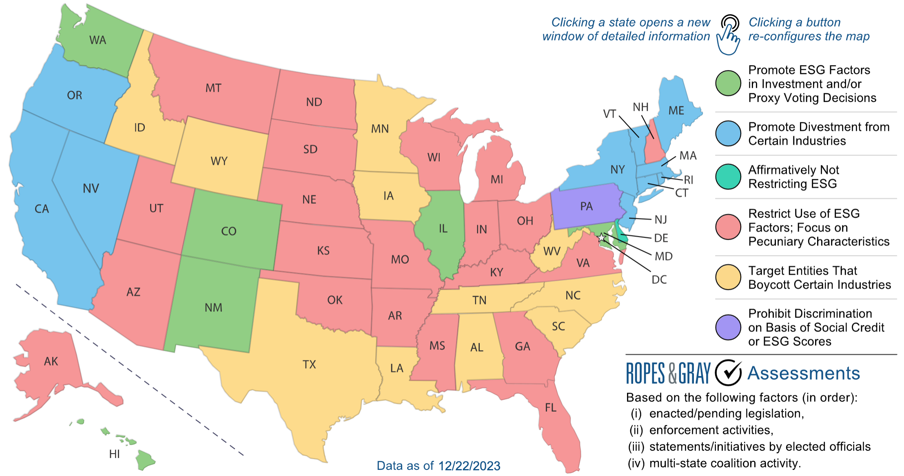
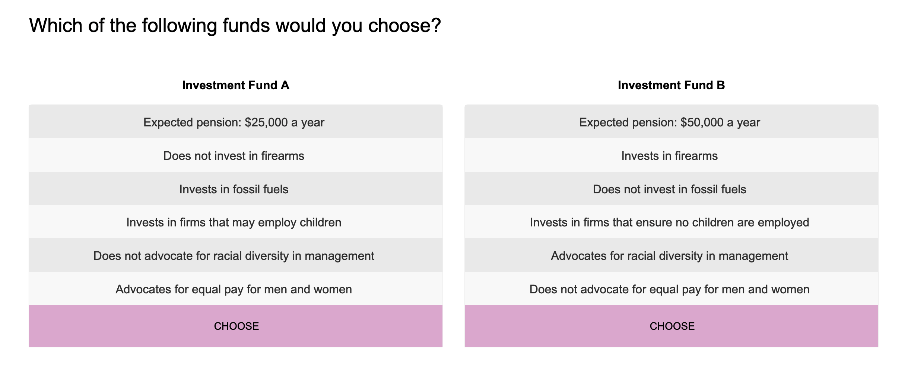
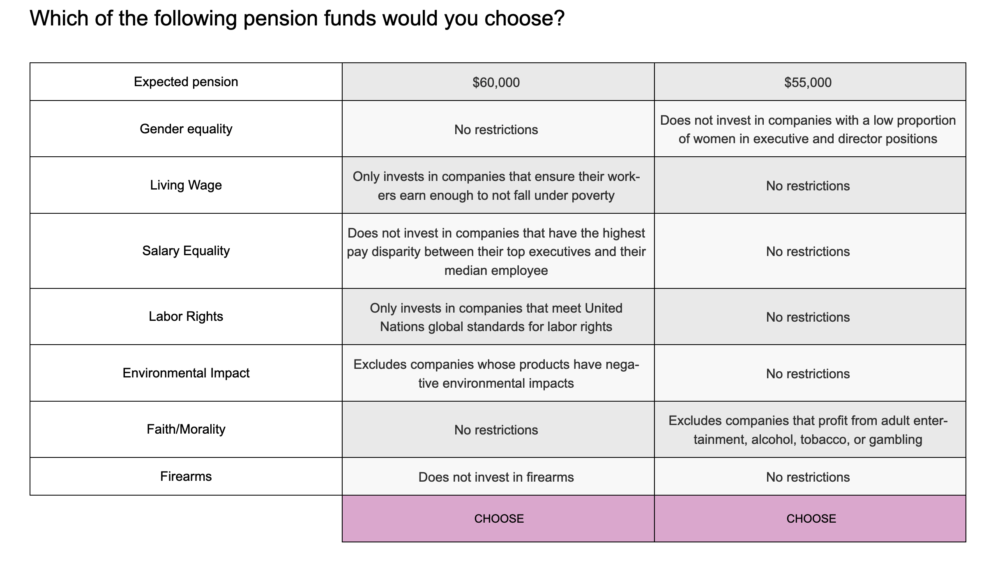
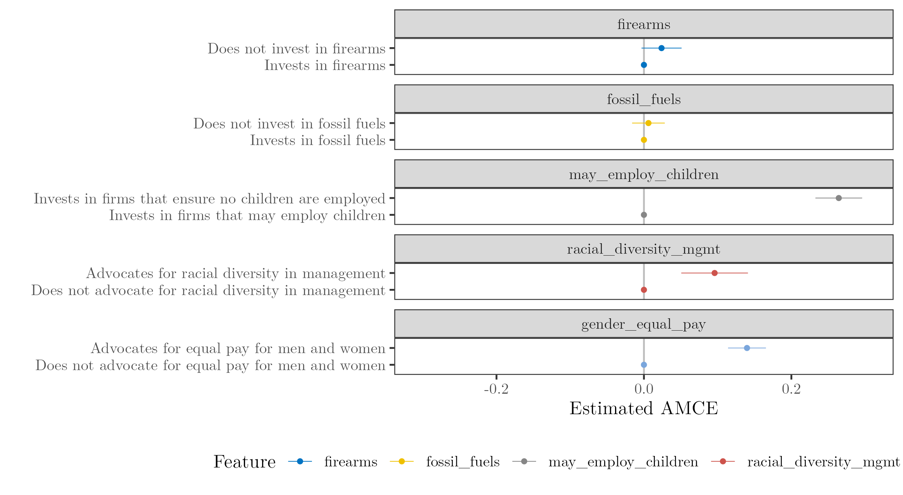
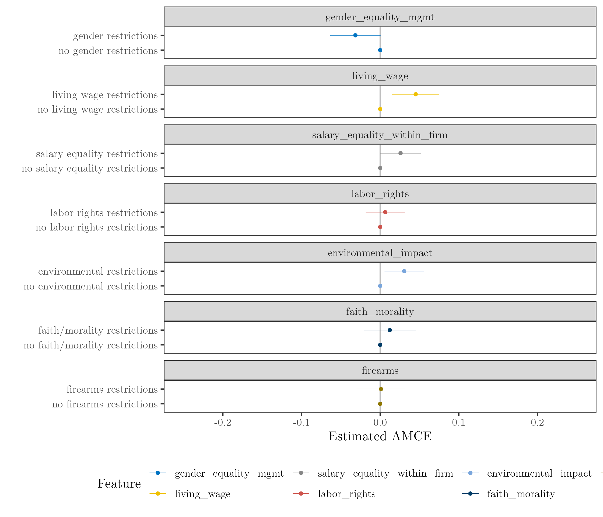
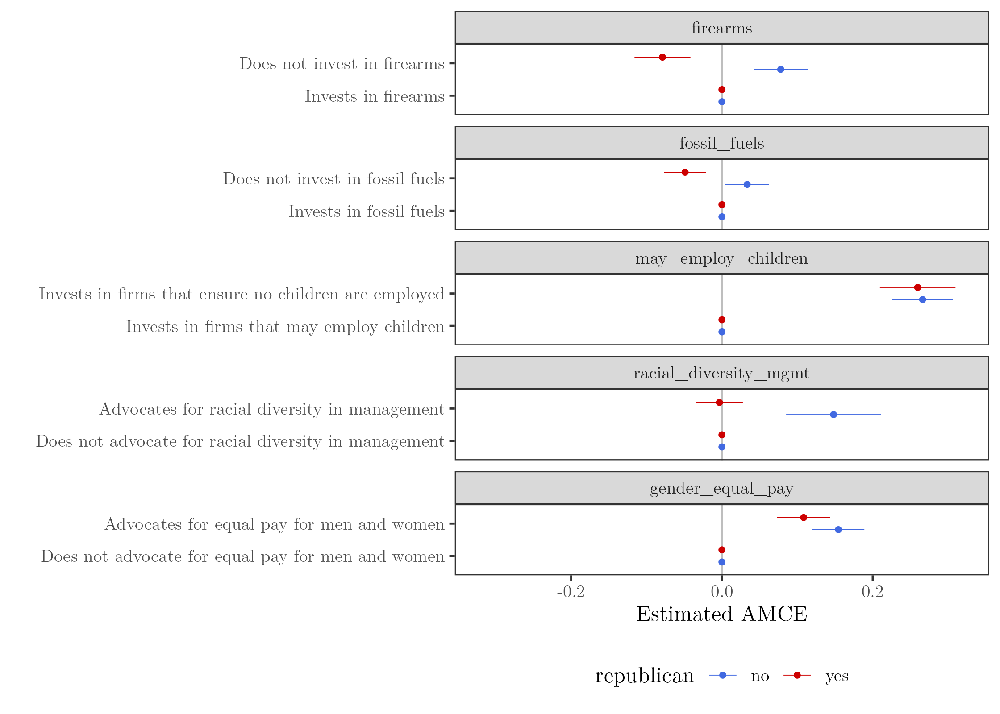
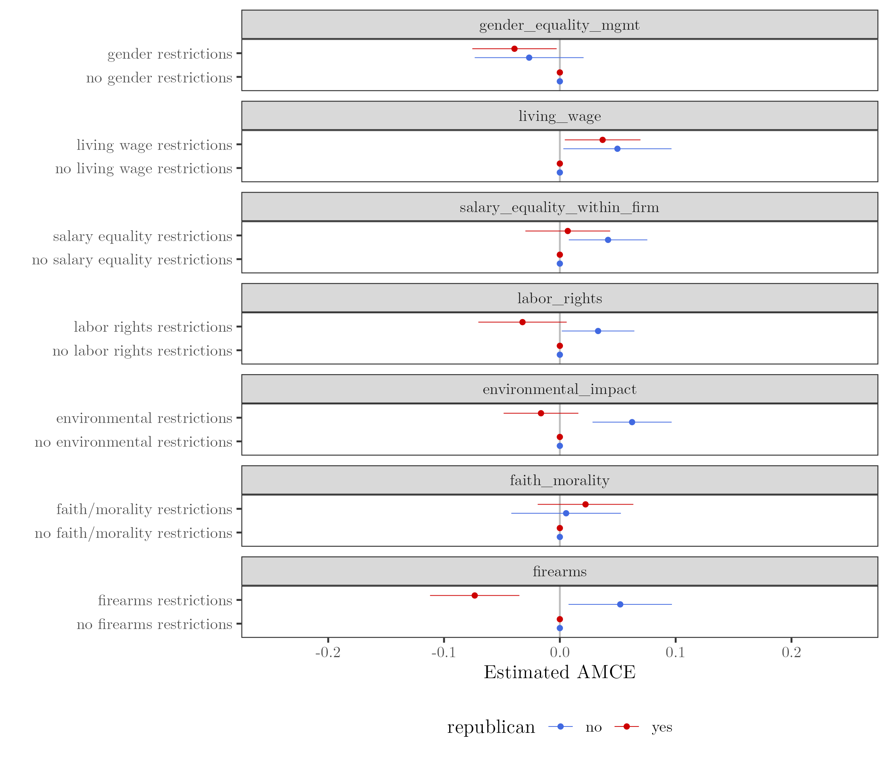

```{r include=FALSE}
library(tidyverse)

```

# Introduction

In recent years, Environmental, Social, and Governance (ESG) investing has emerged as a pivotal aspect of modern financial management, sparking debates that straddle the domains of economics, ethics, and politics. ESG investing fundamentally involves integrating environmental, social, and governance considerations into investment decisions, a practice born from the growing recognition of how these factors can significantly impact financial performance and societal well-being [see, e.g., @edmans2023]. With trillions of dollars under management globally, ESG investments have become a major force in the financial world, reshaping how institutions and individuals approach investing.

The ascent of ESG investing has not been without controversy. The concept has become highly politicized, with entities like BlackRock and other major financial players at the center of a heated debate [@moynihan2022]. This politicization is vividly reflected in the legislative actions taken by several U.S. states regarding the management of their state pension funds. These legislative efforts are split along ideological lines. Some states endorse ESG investments under the belief that they align with their constituents' preferences and best interests. Others vehemently oppose such strategies, arguing that they represent a breach of the fund managers' duty of loyalty to their beneficiaries.

This dichotomy raises an essential but underexplored question: How representative is the ESG-related pension management legislation of the actual preferences of pension plan participants? Despite the growing body of literature on ESG investing, there exists a notable gap in empirical evidence regarding the representativeness of such legislative actions. This article aims to address this shortfall. Through this examination, the paper sheds light on the alignment---or lack thereof---between political actions and constituent interests in the arena of ESG investing, offering insights that are crucial for policymakers, investors, and scholars in understanding the complex interplay between finance, politics, and governance.

In pursuit of a comprehensive understanding of the alignment between ESG-related legislative actions and stakeholder preferences, this study employs a powerful research methodology: conjoint analysis. This innovative approach allows us to delve deep into the stakeholders' preferences regarding pension fund investment strategies. Participants in this study engaged in a series of forced-choice decisions, where they had to choose one of different investment options presented to them, each characterized by unique attributes related to financial returns and ESG considerations. The methodology's advantage lies in its ability to simulate real-world trade-offs, decomposing the value of complex products with several attributes, and minimize social desirability bias [@bansak2021].

Two separate conjoint experiments with large samples of U.S. retirement plan participants provide insightful information about their preferences. The conjoint experiments paint a revealing picture of stakeholder attitudes in the context of ESG investing. Even among individuals identifying as conservatives, there is a demonstrated willingness to sacrifice potential profits to support companies that combat child labor, advocate for gender pay equality, and pay living wages. However, when social goals are presented indirectly as "labor rights," conservative participants focus more on profitability. These nuanced preferences stress the complexity of people's values and the critical importance of the framing of responsible funds' strategies, and suggest that misconceptions about ESG investing and the non-saliency of certain social externalities may explain the support for anti-ESG legislation efforts.

This Article is structured as follows: Section 2 provides background information on fiduciary duties, public pensions management, and the politicization of ESG investing. Section 3 reviews the literature on concessionary investing and presents the main hypotheses this study tests. Section 4 discusses the methodology this article uses. It explains conjoint experiments and how the data were collected and discusses the relevant estimands for the present analysis. Section 5 presents the findings, revealing a widespread agreement among the U.S. population in favor of supporting companies that promote equal pay for men and women, ensure living wages for their employees, and implement actions to prevent child labor. Section 6 discusses the findings and puts them into the context of related studies. Section 7 concludes. It argues that the heterogeneity and complexity of public retirement fund participants demand a more flexible supply of plans that better allow the alignment of the participants' values with their investments.

# Fiduciary Duties and The Politicization of Public Pensions Management

A fiduciary duty underpins the relationship between pension fund beneficiaries and their managers, with the latter expected to act in the best interests of the former [@schanzenbach2018]. Historically, the primary duty of pension fund managers was to maximize financial returns. However, the emergence of ESG concerns, including climate change and social inequality, led to reevaluating what constitutes prudent investment strategies. While ESG concerns may well be understood as risk management [@edmans2023], ESG's evolution reflects a broader shift in the understanding and application of fiduciary responsibilities in the context of global challenges and stakeholder expectations [@pollman].

In the United States, the approach to ESG investing within public pension fund management is characterized by a diverse and evolving set of legislative responses, reflecting the varied political and economic priorities across states. At one end of the spectrum, some states have embraced ESG considerations in their pension fund management. Maine, for example, passed a law in 2021 that requires its public employee retirement system to divest from major fossil fuel companies by 2026.[^1] Similarly, the Illinois Sustainable Investing Act,[^2] enacted in 2019, mandates that state and local government entities managing public funds incorporate sustainability considerations, including environmental and social factors, into their investment decisions [@ropesgrayllp2023].

[^1]: State of Maine. LD 99. Available at: <http://www.mainelegislature.org/legis/bills/getPDF.asp?paper=HP0065&item=4&snum=130>

[^2]: Illinois Sustainable Investing Act (30 ILCS 238/) . Available at: <https://www.ilga.gov/legislation/ilcs/ilcs3.asp?ActID=4027&ChapterID=7>

Conversely, a number of states have taken a critical stance on integrating ESG factors into pension fund management, highlighting a significant divide in approaches across the United States. A particularly striking instance of this trend is the decision by the state of Florida to actively divest approximately \$2 billion from BlackRock, one of the world's largest investment management firms, specifically citing disagreements with the firm's ESG investment policies [@kerber2022]. Other notable examples are Texas[^3] and West Virginia,[^4] which have enacted legislation prohibiting state investment funds, including public pension funds, from investing in companies that boycott fossil fuel industries. Similarly, Arizona has passed a law[^5] requiring state-run investment funds to prioritize financial returns above all else, thereby explicitly discouraging the consideration of ESG factors if they are perceived to compromise financial performance.

[^3]: Texas Legislature. (2021). *Senate Bill 13: Relating to state financial assistance and the investment of public funds of certain governmental entities that boycott energy companies*. Retrieved from <https://capitol.texas.gov/tlodocs/87R/billtext/html/SB00013F.htm>

[^4]: West Virginia Legislature. (2021). *House Bill 2492: Relating to investment of public funds*. Retrieved from <http://www.wvlegislature.gov/Bill_Status/bills_text.cfm?billdoc=hb2492%20intr.htm&yr=2021&sesstype=RS&i=2492>

[^5]: Arizona State Legislature. (2022). *Senate Bill 1489: An Act Amending Sections 35-312 and 35-393, Arizona Revised Statutes; Relating to Public Monies*. Retrieved from <https://www.azleg.gov/legtext/55leg/2R/bills/SB1489P.htm>

The federal viewpoint, especially regarding private sector retirement plans regulated by the Employee Retirement Income Security Act of 1974 (ERISA), has been markedly affected by political dynamics, showcasing distinct fluctuations alongside transitions in presidential administrations. The Department of Labor's 2022 rule, promulgated under the Biden administration, represents a notable pivot from the policies of its predecessor by adopting a more encouraging stance towards the inclusion of Environmental, Social, and Governance (ESG) criteria in investment considerations. Figure \@ref(fig:mapplot) shows a simplified summary of the state laws passed until December 2023.

```{r include=FALSE}
library(extrafont)
```

```{r mapplot, echo=FALSE, fig.align="center", fig.cap="ESG Legislation in US States (2023)", out.width='1\\textwidth'}

```

This patchwork of legislative actions across the U.S. underscores the complexity and contention surrounding ESG investing in pension fund management. A critical aspect yet to be fully explored is the actual preferences of fund beneficiaries for ESG-aligned investment options. Comprehensive evidence that maps these attitudes across the broader U.S. population remains sparse. This gap points to a need for a more detailed understanding of the public's perception and valuation of ESG considerations in their investment choices, which motivates this work.

# Literature Review

This study delves into various strands of literature, primarily focusing on people's preferences for socially responsible pension funds and the broader context of altruism and socially responsible investing. @simpson2015 conduct a throughout review of the causes of altruism, and conclude emphasizing the importance of social norms, rules, and reputations in fostering cooperation and prosocial behavior. @bennett2017 observe that religiosity, minority religion membership, and religious diversity correlate with a higher propensity to assist strangers. This finding contrasts with @wiepking2014, who find no direct link between country-level devoutness in Europe and charitable giving, but note an increased likelihood of religious giving in religiously heterogeneous countries.

On concessionary investing, @barber2021a study the trade-off between expected financial returns and the nonpecuniary benefits of impact investing, using data from approximately 24,000 venture capital and growth equity investments made by around 3,500 investors between 1995 and 2014. By analyzing this data with discrete choice and hedonistic pricing methods, they investigate whether investors are willing to pay for the social or environmental impact of their investments. They find that, indeed, certain investor groups, including development organizations, foundations, financial institutions, public pension funds, and investors from Europe, Latin America, and Africa, exhibit a discernible willingness to accept lower financial returns for the sake of achieving positive societal impacts. This willingness varies significantly across investor types and is influenced by factors such as mission objectives and regulatory pressures. In a similar vein, @biong2017 conduct a conjoint experiment among 276 Norwegian small and medium sized companies to examine to what extent managers emphasize social responsibility vs expected returns when choosing investment managers for their employees' pension funds. They discover that employers assign the highest importance to suppliers that offer funds committed to socially responsible investment (SRI) practices, with the next priorities being the suppliers' corporate brand reputation, the expected returns of the funds, and the management fees charged by the suppliers. Furthermore, employers with investment expertise prioritize expected returns more and place less emphasis on SRI in their selection process, whereas employers with defined CSR-strategies place less importance on expected returns and more on social responsibility. @heeb2022 investigate how investors' WTP for sustainable investments responds to the social impact of those investments, using a framed field experiment. They find that while investors exhibit a substantial WTP for sustainable financial commitments, this WTP does not significantly increase for greater impact investments, suggesting an emotional rather than calculative valuation of impact.

In the pension management domain, several studies have shown a strong preference for socially responsible alternatives. Most of the strong evidence in this respect, however, comes from Northern European countries---especially the Netherlands. @apostolakis2016 report that over half of their Dutch respondents prefer socially responsible investment portfolios, with a significant portion willing to incur additional costs for this choice. Similarly, @delsen2019 find that a majority of Dutch pension plan participants aged 40 and above are inclined towards sustainable investments, even if it means higher premiums or lower benefits. However, @borgers2014 add that Dutch citizens often struggle to balance financial decisions with non-financial preferences, a dilemma partly attributed to limited financial sophistication.

Studies in the U.S. reveal more nuanced attitudes towards socially responsible investments. @hirst2021 demonstrate that American investors are willing to sacrifice monetary gains for social causes, but to a lesser extent compared to their consumer or philanthropic behaviors. Additionally, a considerable segment of their sample showed reluctance to make financial sacrifices for pro-social initiatives. Echoing this sentiment, @haber2022 stress significant differences in ESG preferences across various age and wealth demographics, with older and less wealthy investors being more resistant to sacrificing retirement savings for ESG causes.

Based on the literature reviewed, the main hypotheses this study tests are the following:

**Hypothesis 1**. A significant part of the population will derive utility from pursuing environmental and social goals with their investments.

**Hypothesis 2**. There will be substantial heterogeneity among the respondents. And considering the developments of pro and anti-ESG state legislation, it is expected there will be a clear split of preferences between respondents who identify as Republicans and Democrats or lean towards one of these groups.

**Hypothesis 3**. Religious people will tend to be more altruist than non-religious people.

# Methods

## Conjoint Analysis

Since the early seventies, the term "conjoint analysis" has primarily been used to refer to a class of survey-experimental methods that estimate respondents' preferences based on their overall evaluations of alternative profiles that vary across multiple attributes [@bansak2021]. The general idea behind conjoint analysis is that *features* or *attributes* embodied in objects or people drive consumers' preferences for that product. Features or attributes are product or people's characteristics, such as the screen size of a tablet, its memory, and battery life; or a candidate's education, work-experience, gender, among others. The notion that product-specific attributes lead people to prefer an option over another is consistent with economic and consumer-behavior utility maximization theories [@ben-akiva2019]. For instance, two job opportunities usually involve different salaries, commute times, and benefits packages. Since there is more than one variable---or "dimension"---to consider when choosing what job offer to accept, such a choice is *multidimensional*.

Conjoint analysis allows for estimating the relative importance of each attribute or feature on people's decision making. In the example above, it allows determining how important each of the attributes (i.e., salary, commute time, and benefit package) is for job applicants, and how changes in attribute levels affect the probability of accepting an offer. Conjoint analysis can take many forms but in any of them the study participants compare at least two options presented to them. Each comparison is a "choice-set," and each participant makes several choices per study. The two most common forms of conjoint experiments are rating-based and choice-based surveys [@green1990]. The former asks the study participants to rank each option presented to them. The latter, to choose the option they prefer in each choice-set. The method infers people's preferences from the *profiles* (i.e., options available to choose with randomly assigned levels of each attribute) people choose and/or ranked.

Conjoint experiments have many advantages over traditional A/B tests. In addition to controlling for several potential confounders at once, conjoint experiments are better at minimizing social-desirability bias---because multiple features are changing at the same time, the task does not force the respondent to focus on a single feature. By avoiding such a focus, conjoint analysis reduces the possibility of induced demand artifacts. A multifeature conjoint analysis task is more likely to be reliable and valid than a contingent valuation task in which the consumer trades off only one feature and price [@hainmueller2014].

## Study Design

As noted, this work is based on two forced-choice conjoint experiments. Each participant first read the survey instructions, which summarized how investment funds may promote environmental and social causes and described the *attributes* (i.e., features or variables that influence the decision-makers' choices) included in the conjoint vignettes. The questionnaires started with socio-demographic questions and both surveys included two attention checks. Subsequently, each participant saw the conjoint vignettes. In both experiments each participant had to make 12 choices and select one of two *profiles*. The second experiment included an additional part between the socio-demographic questions and the conjoint vignettes, which intended to measure general preferences for different combinations of investment packages that included only one ESG attribute. This was to have a benchmark to compare market share simulations. Figures \@ref(fig:cj1) and \@ref(fig:cj2) show how the conjoint vignettes looked in the first and second experiments, respectively.

In the first experiment, the attributes of the conjoint vignettes were the following: (i) expected pension (from \$20,000/year to \$60,000/year, by \$5,000 increments), and the following types of investment restrictions: (ii) companies that sell firearms, (iii) entities that profit from fossil fuels, (iv) firms that may employ children, (v) companies that advocate for racial diversity in management, and (vi) firms that advocate for equal pay between men and women. There were no randomization constraints, which made 192 combinations (i.e., profiles) possible ($6 \times 2^5$).

The second experiment had different variables and levels for the expected pension attribute (7 levels, from \$40,000/year to \$70,000/year with \$5,000 increments). The rest of the variables were the following investment restrictions: (i) companies with a low proportion of women in executive positions, (ii) firms that pay a living wage, (iii) companies with the highest pay disparity between the executives and the median employee, (iv) companies that comply with the UN standards for labor rights, (v) entities that produce products with a negative environmental impact, (vi) firms that profit from adult entertainment, alcohol, tobacco, or gambling, and (vii) companies that sell firearms. Each of these variables had two levels (i.e., present or absent). Thus, there were 896 possible combinations ($7 \times 2^7$). The main reason for the variables change was to compare the results with those of a related study [i.e., @hirst2021].

```{r cj1, echo=FALSE, fig.align="center", fig.cap="Conjoint Vignette First Experiment"}

```

```{r cj2, echo=FALSE, fig.align="center", fig.cap="Conjoint Vignette Second Experiment"}

```

## Sample

The survey distribution was facilitated by Lucid Theorem, leveraging its expansive network to target a diverse respondent pool. This effort aimed to obtain a representative sample of the U.S. population in terms of gender and age demographics. The conjoint analysis questionnaire was hosted on the Conjointly.ly platform, renowned for its intuitive user interface that enhances participant engagement and simplifies the programming of conjoint experiments. An integral feature of the Conjointly.ly system is its automatic filtration mechanism, which screens out responses from individuals demonstrating low levels of engagement with the survey. Adhering to stringent quality control measures, only responses from participants who successfully cleared two attention checks were considered valid. Furthermore, responses completed in less than half or above twice the median completion time were filtered as well.

The final samples were 2,120 and 1,086 participants in the first and second experiments, respectively. There was almost a perfect gender split in the first experiment, with 1078 males, 1031 females, and 11 people who identified as other gender. The sample of the second experiment was slightly unbalanced with more females than men (618 vs 465, and 5 respondents who identified as "other" gender). Statistical weights accounted for this unbalance. Most of the respondents were highly educated in both experiments, with more than 50% having completed at least an undergraduate program. The average age of the respondents was 49 in the first experiment, and 45 in the second. The reported median income in both samples was between \$50,000 and \$75,000 a year. Both samples were weighted to reflect a representative picture of U.S. population regarding not only gender and age, but also income and education, using U.S. census data. The table below summarizes socio-demographic information of the respondents that participated in both experiments, listing each in separate columns.

```{r message=FALSE, warning=FALSE, include=FALSE}
tabdemos <- read_csv("tabdemos.csv")

tabdemos = tabdemos %>% 
  rename(age = age.cat) %>% 
  mutate(education = case_when(education == "college" ~"college",
                               education == "grad school" ~ "graduate degree",
                               education == "hs" ~ "high school",
                               education == "less than hs" ~ "less than high school"))

library(gtsummary)

library(gt)

tab_demos = tabdemos %>%
  tbl_summary(by = experiment) %>% 
  as_kable_extra(caption = "Summary Statistics of Respondents' Socio-demographic Characteristics")

tab_demos = tab_demos %>% 
  kableExtra::kable_styling(
    position = "center", 
    font_size = 11, 
    latex_options = c("striped", "hold_position"))

```

```{r echo=FALSE, message=FALSE, warning=FALSE, results='asis'}
tab_demos

```

## Estimands of Interest

### Average Marginal Components Effect

One of the most widely used estimands in conjoint analysis is the average marginal component effect (AMCE) [@hainmueller2014]. It measures how an attribute change affects the probability of choosing an option (e.g., good, service, candidate, etc). Going back to the job offers example, if a researcher wants to determine how commute times (let's assume there are only two levels: "high" or "low") affect the probability that job candidates accept an offer, the AMCE algorithm will group all the profiles in which commute time was "high" and all the profiles in which commute time was "low." The difference in outcomes (i.e., offers accepted) between the two groups is the AMCE.

In more technical terms, the AMCE is a difference between "marginal means" [@leeper2020]. It represents the causal effect of changing one attribute of a profile while averaging over the distribution of the remaining profile attributes. This method simplifies the interpretation of the multifaceted choice data by quantifying the impact of each attribute on the likelihood of a scenario being chosen. Its simplicity made it one of the most widely used estimands in experimental political science [@bansak2021] to measure, for instance, whether people's ethnicity affects the probability they get a visa [@hainmueller2015], or whether candidates from minority groups are less likely to be elected for office [@doherty2019].

Formally, the AMCE can be expressed as follows:$$AMCE = \frac{1}{N} \sum_{i=1}^{N} (E[Y|X_i=x_i] - E[Y|X_i=x_0])$$

Where: $N$ represents the number of observations or cases, $Y$ denotes the dependent variable of interest, $X_i$ represents the categorical independent variable with attribute levels $x_i$, $x_i$ and $x_0$ are different levels of the independent variable, $E[Y|X_i=x_i]$ is the expected value of the dependent variable when $X_i$ is at level $x_i$, while keeping all other covariates constant, and $E[Y|X_i=x_0]$ is the expected value of the dependent variable when $X_i$ is at level $x_0$, while keeping all other covariates constant.

A particular advantage of this estimand is its straightforward graphical representation, especially when comparing two groups of respondents. This is one of the reasons why this study mostly reports AMCEs.

### Multinomial Logit

The Multinomial Logit (MNL) model is rooted in the concept of Random Utility Maximization (RUM) [@ben-akiva1985]. When comparing two products, rational consumers will choose the option that provides them with the highest utility. According to this framework, utility is modeled as having an observed component due to the variation of product features and an unobserved component due to the impact of unobserved variables:

$$
U_{ij} = X_{ij} + \epsilon_{ij}
$$

where $U_{ij}$ represents the total utility that individual $i$ associates with alternative $j$, $X_{ij}$ is the systematic component of utility (a vector of explanatory variables), and $\epsilon_{ij}$ is a random error term that captures the unobservable or stochastic component of utility, which is assumed to be identically and independently distributed (IID).

The observed utility $X_{ij}$ is the sum of the partial contributions of each feature and price. A "partworth" is the partial contribution of a level of a feature (e.g., the difference in utility of buying a tablet with 256 vs 128gb of storage). In the utility function $U_{ij}$, for individual $i$ choosing option $j$, partworths are included as follows:

$$
U_{ij} = \sum_{m=1}^M \beta_{m} X_{ijm} + \epsilon_{ij}
$$

where $\beta_{m}$ represents the partworths or utility coefficients for each attribute level $m$, $X_{ijm}$ is a variable indicating the presence (or level) of attribute $m$ in choice $j$ for individual $i$, and $M$ is the total number of attributes or attribute levels.

MNL estimates these partworths from the respondents' choices. This calculation is typically done through Maximum Likelihood Estimation (MLE) [see, e.g., @train2009]. The likelihood function in MNL is based on the probability that the observed choices are made given the utility model. The MLE process finds the values of $\beta m$ that maximize the likelihood of observing the choices made by all respondents in the sample. After calculating the value of each attribute, the model predicts the probability that individuals choose an option within the choice set as a function of its features. The probability $P_{ij}$ of individual $i$ choosing option $j$ in the MNL model is given by a ratio of exponentiated utilities:

$$
P_{ij} = \frac{e^{\sum_{m=1}^M \beta_{m} X_{ijm}}}{\sum_{k=1}^J e^{\sum_{m=1}^M \beta_{m} X_{ikm}}}
$$

As the formula above clearly illustrates, the MNL output is a set of choice probabilities, which is based on the relative preferences for different levels of the product features. MNL assumes that preferences or partworths are homogeneous across all individuals. In other words, it does not account for variation in preferences between different decision-makers. However, interaction MNL models do account for observable heterogeneity, and two notable extensions of MNL, the Mixed Multinomial Logit (MMNL) [@mcfadden2000], and its Hierarchical Bayes (HB) variant [@allenby2006], allow estimating partworths for each respondent, which is particularly useful for analyzing heterogeneous preferences. Moreover, having individual-level coefficients allows researchers to calculate hypothetical market shares of different profiles. Markov Chain Monte Carlo (MCMC) methods are used for estimating parameters in Hierarchical Bayes models. MCMC works by constructing a Markov chain with a stationary distribution that is the posterior distribution of interest. Through iterative sampling, MCMC generates a sequence of values that approximate this distribution. These samples are then used to estimate the parameters of interest, providing a comprehensive way to account for uncertainty and variability in model estimations. HB will be used for willingness to pay (WTP) and market share simulations because of its advantages handling respondent heterogeneity and outliers [@regier2009]. WTP is computed by dividing the utility of each feature by the utility of money.

# Results

## General preference for social sustainability

When considering AMCEs for the population as a whole, we find that the respondents had a very strong preference for funds that take affirmative measures against child labor ($AMCE = 0.26, \space s.e. = 0.02, \space p < .001$), favor gender pay parity ($AMCE = 0.14, \space s.e. = 0.01, \space p < .001$), and advocate for racial diversity in management ($AMCE = 0.1, \space s.e. =0.02, \space p < .001$). Figure \@ref(fig:amce1cjmain) shows these results, which represent the main findings of the first conjoint experiment. In the second experiment, the effect sizes were smaller.The participants showed a general preference for funds that ensure firms pay a living wage ($AMCE = 0.05, \space s.e. = 0.015, \space p < .004$), exclude companies with a large wage disparity between management and the median employee ($AMCE = 0.025, \space s.e. = 0.013, \space p <0.05$), and ban firms whose products have a negative environmental impact ($AMCE = 0.03, \space s.e. = 0.012, \space p < .017$). Figure \@ref(fig:amce2cjmain) displays these results.

```{r amce1cjmain, echo=FALSE,  message=FALSE, warning=FALSE, fig.align="center", fig.cap="AMCE First Experiment"}


```

The HB model provides similar results. The respondents' willingness to sacrifice profits were not only statistically significant but also substantial. The median respondent was willing to pay \$7,600 to prevent child labor (95% CI = [\$6,170, \$8.630]), \$1,620 to not invest in firearms (95% CI = [\$1,170, \$2.370]), \$2,490 to promote racial diversity in management (95% CI = [\$1,920, \$3.030]), and \$5,620 to support gender pay parity (95% CI = [\$4,970, \$6.370]).

Market share simulations show that sustainable funds would dominate if people made informed choices about their pension investments. Based on the individual-level utilities calculated in the first experiment, if people had to choose between a package with only sustainable features and another with no sustainable characteristics, and both entailed the same expected pension of \$40,000, 83.4% would choose the sustainable investment package (95% CI: [81.5%, 85.1%]). With the second experiment data, however, the difference would be much smaller, with 53.1% of people choosing the sustainable investment package (95% CI: [51.3%, 56.3%]).

```{r amce2cjmain, echo=FALSE,  message=FALSE, warning=FALSE, fig.align="center", fig.cap="AMCE Second Experiment"}


```

## Consensus about child labor, gender pay gap, and living wage

Not surprisingly, there was substantial heterogeneity among the responses of liberal and conservative participants. When comparing the preferences of those that identified as Republicans with those that did not (independents plus democrats), it is clear that republicans were less likely to choose funds that exclude fossil fuels ($\Delta AMCE = -0.16, \space s.e. = 0.026, \space p <.001$) or firearms ($\Delta AMCE = -0.08, \space s.e. = 0.020, \space p<.001$) (see Figures \@ref(fig:amce1byr) and \@ref(fig:amce2byr) below). However, people from all over the political spectrum tended to favor funds that advocate for gender pay parity and take affirmative measures to prevent child labor. The HB model shows identical results, estimating that Republicans were willing to forego \$8,030 (95% CI = [\$5,900; \$10,040] to reward funds that take measures against child labor and \$3,880 (95% CI =[\$2,740; \$4,730]) to support funds that advocate for pay parity between men and women.

While republicans were indifferent to the pursuit of racial diversity in management, independents and democrats tended to favor said goal. One of the main aims of the first experiment was to assess whether people in Florida were more conservative than average. Interestingly, there were no statistically significant differences between Florida and the American average. If anything, people in Florida appeared to care more about child labor than the U.S. average. But the difference did not pass a significance test.

The HB simulations indicate that in the first experiment 70.6% of Republicans would prefer an investment package with only sustainable features and equal profitability (95% CI: [67.4%, 72.9%]), and 62.6% would forego \$5,000 to constrain their investments to sustainable features (95% CI: [59.7%, 65.2%]). In the second experiment, the HB simulations suggest 42.9% of Republicans would prefer the all-sustainable investment package with identical expected profitability, and 36.3% (95% CI: [33.9%, 41.1%]) would be willing to forego \$5,000 to invest their money exclusively in sustainable options.

```{r amce1byr, echo=FALSE,  message=FALSE, warning=FALSE, fig.align="center", fig.cap="AMCE First Experiment by Ideology"}

```

```{r amce2byr, echo=FALSE,  message=FALSE, warning=FALSE, fig.align="center", fig.cap="AMCE Second Experiment by Ideology"}

```

## The framing and saliency of social features has a large effect on people's preferences

One of the main findings of the first experiment was the very substantial effect of the child labor feature on most respondents. Child labor is one of many variables the UN includes as a part of its international labor rights standards. This was properly disclosed to the participants when defining each attribute of the conjoint vignette in the introduction of the second experiment. While most of the respondents did prefer options that excluded companies that did not meet the UN labor rights standards, the effect was much lower compared with funds that did not take measures against child labor. Notably, the effect was negative for Republicans. While the negative AMCE was not statistically significant, the HB model indicated the median Republican respondent was willing to sacrifice \$522 (95% CI = [\$985, \$205]) to ensure her investments were not constrained by the UN labor rights standards.

## Misconceptions about the meaning of ESG appear to drive the support for anti-ESG legislation

One of the first questions the participants saw in both questionnaires was whether they would prefer their pension funds be managed according to ESG considerations. Conditional on their answers, respondents were categorized as either having a "pro" or "anti" ESG prior.

In both experiments, people with an anti-ESG prior either opposed or were indifferent to *environmental* features. However, they did support some *social* causes. In the first study, those with an anti-ESG prior preferred funds that advocated for gender pay parity $(AMCE = 0.11, \space s.e.=0.018, \space p <.005)$, supported racial diversity in management $(AMCE = 0.09, \space s.e.=0.04, \space p <0.05)$, and took measures against child labor $(AMCE = 0.24, \space s.e.=0.019, \space p <.005)$. The HB model reports similar results with statistically significant WTP estimates for each feature of \$4,320, \$1,620, and \$6,560, respectively. Moreover, those with an anti-ESG prior were indifferent to exclusions on firearms and fossil fuels (i.e., the effects of firearms and fossil fuels were not statistically different from zero). In the second experiment, the AMCEs were not statistically different from zero for any feature. However, the HB model---which is a better tool for handling participant heterogeneity---does report that the *median respondent* with an anti-ESG prior was willing to pay \$602 to support gender pay parity (95% CI = \$35; \$1,050), \$1,370 to restrict her investments to firms that pay a living wage (95% CI = [\$940; \$1,760]), and \$417 to not invest in firms with a negative environmental impact (95% CI = [\$80; \$951]).

## Religion Has Mixed Effects on Altruism

The literature review outlined in Section 2 reveals mixed evidence regarding the influence of religiosity on altruistic behavior. Considering the relevance of this theme to this research and the minimal burden of adding an extra item to the questionnaire, this study aimed to explore whether individuals who pray or meditate often are more inclined than their non-religious counterparts to choose investment options with social or environmental constraints.

In the first experiment, there were two significant differences based on individuals' frequency of prayer or meditation. Those who engaged in these practices almost daily were less likely to select investment portfolios with restrictions on firearms ($\Delta AMCE = -0.06, s.e. = 0.016, p<.005$) or fossil fuels ($\Delta AMCE = -0.04, s.e. = 0.01, p<.005$). This tendency was also observed when analyzing data exclusively from non-Republican participants.

In contrast, the second experiment presented a unique finding within the entire sample: religious individuals showed a higher propensity for investments with faith/morality constraints. The effect was substantial ($\Delta AMCE = 0.14, s.e. = 0.05, p<.005$), and it persisted when excluding Republicans from the analysis. Moreover, religiosity affected Republicans' preferences for salary equality. Highly religious Republicans were more likely to opt for investment options that included salary equality restrictions ($\Delta AMCE = 0.27, s.e.=0.10, p<.006$).

# Discussion

There are several methodologies for measuring people's preferences. This study merged the analyses used in political science and marketing to provide more understandable and informative results. An important limitation of this work, however, is that the participants faced no monetary incentives to reveal their preferences. Thus, it is possible that they presented themselves as more generous than they actually are. The original design intended to account for this possible issue with a lottery, in which the respondents could win \$100 to invest in shares that matched their preferences. Unfortunately, because of California regulations,[^6] this option was not feasible. Nevertheless, the findings show credible trends. Especially with respect to highly-politicized issues, such as environmental and firearms restrictions, in which the respondents split in partisan lines. It is important to emphasize here that people's utilities were inferred from their choices, not their statements. Thus, any difference in preferences for firearms restrictions between conservatives and liberals stem from the profiles the participants chose. WTP estimates also stem from the very same choices. Moreover, the WTP estimates are very close to what the 2023 Rock Center Survey of Investors, Retirement Savings, and ESG reports (between 1% and 5% of people's pension).[^7] And participants over 55 years old were willing to sacrifice lower amounts than people who were farther from retirement, and highly religious people were more likely to choose investment packages with faith/morality restrictions.

[^6]: California Penal Code. Part 1, Title 9, Chapter 9.

[^7]: The survey results are available here: <https://www.hoover.org/sites/default/files/research/docs/ESG%20Survey%202023%20-%20FINAL.pdf>

This work finds substantial heterogeneity among the U.S. population regarding some environmental and social features of ESG investing. Despite people's heterogeneous preferences, there is much more consensus on social sustainability than what conventional wisdom assumes. This is a key difference with the Rock Center surveys, in which the participants tended to express a similar degree of concern for environmental and social issues. And this consensus falsifies the representativeness of anti-ESG legislation, even in Florida. However, as noted above, and despite using a different methodology, the Rock Center surveys show similar results about the amount of money people would be willing to sacrifice to support social or environmental causes, and that people who are closer to retirement place a higher value on profitability. The WTP estimates are much higher than those @hirst find. WTP estimates are very sensible to the range of prices used in the conjoint vignettes. @hirst designed a more complicated decision task (not a conjoint experiment) that always involved a sacrifice between 0.1% and 9% to invest in a sustainable option, discarded what they regarded as inconsistent responses (which triggered a sample reduction of almost 40% ), and only considered the responses of people with a positive WTP in the calculation [@hirst, p.1009]. The superior methodology used in this work and much larger sample sizes of this study give it an edge.

As noted, the effect sizes were much smaller in the second experiment. The psychology literature has documented that people are more likely to act ethically when a decision cue increases the saliency of a choice's moral dimension, which is consistent with a self-concept maintenance theory [see, e.g., @mazar2008]. It is likely that a similar effect occurred in the first experiment, in which the child labor feature had such a large effect. In fact, in some of the open-ended comments, many participants who identified as Republicans referred to child labor as a case in which children's autonomy was coerced.

There was another important difference between the results of the first and the second experiments. While investment exclusions affecting "fossil fuels" split the respondents in partisan lines, exclusions that focused on the "environmental impact" of companies did not affect the decisions of conservative respondents (i.e., progressives preferred the feature and conservatives were indifferent to it). The impact of policy framing on policy popularity is well-documented [see, e.g., @hardisty2010]. This appears to be a similar case in which the "fossil fuel" label acts as a stronger cue for Republicans. In fact, the median Republican respondent was willing to give up \$1,890 to ensure her pension fund managers did not exclude investments in fossil fuels (95% CI = [\$2,470, \$1,390]).

The preceeding paragraphs have important implications for the framing of sustainable investing. Broad categorizations that trigger people's political identities seem unlikely to nudge people, and especially conservatives, towards more sustainable behavior. For instance, nowadays the "frair-trade" movement appears to be in decay [see, e.g., @subramanian2019]. And perhaps the movement would be more successful with a different framing that would make it easier for people to understand what types of trade-externalities it addresses. Maybe more than one label would be necessary for appealing to different types of consumers. Child labor was a feature that moved most respondents. However, child labor has soared in the U.S. in recent years [@gurley2023]. This study suggests that most people would benefit substantially from knowing what products and companies exploit children to invest (and potentially buy) elsewhere. And it appears that the only way to encourage people to change their current behavior is a salient disclosure that makes child labor salient to investors. Considering people's very high WTP to address child labor issues, it is not unreasonable to assume that more informative and effective disclosures would be efficient, even if costly.

People's heterogeneous preferences also have significant implications for the "ESG" label. Any method for simplifying and condensing information is imperfect [see, e.g., @loewenstein2014]. But ESG metrics have been especially imperfect because of the lack of standardization, among other reasons [@brest2021]. For instance, Tesla has made the conflicts between governance and environmental features particularly clear. The nuanced differences in how individuals, especially among groups like Republican respondents, prioritize environmental and social issues further highlight the limitations of a one-size-fits-all ESG label. Because of these varied concerns and values, there is a compelling argument for disaggregating ESG into its constituent elements---Environmental, Social, and Governance. Such a separation could provide substantial value for investors by offering a more transparent and tailored approach to understanding and evaluating these components [see, e.g., @temple-west2022]. By breaking down ESG into distinct categories, investors could align their investments more closely with their specific interests and ethical considerations. If politicians are genuinely concerned about potential breaches of fiduciary duties arising from state pension fund managers considering ESG factors, prioritizing a diverse array of investment options should be a priority.

# Conclusions

The current study assessed the representativeness of existing state laws on public pension fund management. These regulatory frameworks tend to homogenize investor attitudes toward sustainability, often relying on rigid and oversimplified assumptions about the beneficiaries' attitudes and values. This approach fails to capture the diverse range of individual values and priorities, resulting in a generalized representation that does not accurately reflect the nuances of people's preferences, particularly regarding their willingness to forgo pension returns in support of environmental and/or social objectives.

A pivotal discovery of this research is the widespread consensus on social sustainability. This consensus is remarkably present across various groups, including those traditionally opposed to ESG investing. This finding suggests a broader, perhaps previously underestimated, appreciation for social aspects in investment decisions. Moreover, this consensus hints that prevailing misconceptions about ESG might be influencing public opinion in conservative states and, consequently, the support for anti-ESG legislation. Indeed, this study only reveals a pronounced partisan division in attitudes toward investment restrictions on firearms and fossil fuels. And the results suggest that many with an anti-ESG prior assume that ESG is just an environmental movement. Nevertheless, the sharp partisan divide further indicates that mandatory ESG investing laws also contradict the preferences of a significant segment of the population.

The experimental results further emphasize the critical impact of how sustainable goals are framed and highlighted in influencing people's choices. When environmental goals were framed broadly, Republicans were indifferent to them. However, when framed as a ban on fossil fuels, Republicans were willing to sacrifice a part of their pensions to ensure their investments were not subject to said constraint. While child labor had a very large effect on most respondents in the first experiment, compliance with international labor right standards---which include a ban on child labor---had a much lower effect. This difference suggest that a general label that many associate with a political agenda leads people who truly care about child labor to behave inconsistently with their preferences.

In light of these insights, this study strongly advocates for the separation of the ESG label into its individual components: Environmental (E), Social (S), and Governance (G). This disaggregation would facilitate a more precise and faithful alignment with the diverse values of individual investors. It would empower them to make choices that resonate more closely with their unique concerns and preferences, moving away from a one-size-fits-all ESG model that might not fully encapsulate their interests. This nuanced approach not only honors the diversity of investor values but also has the potential to widen the appeal of sustainable investing by offering clearer, more personalized investment options.

# References
