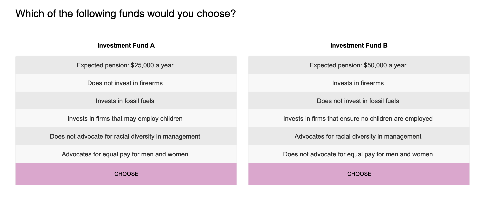
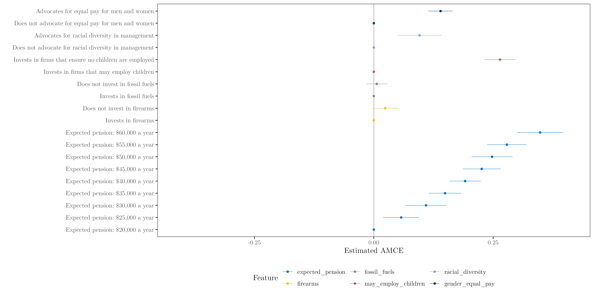
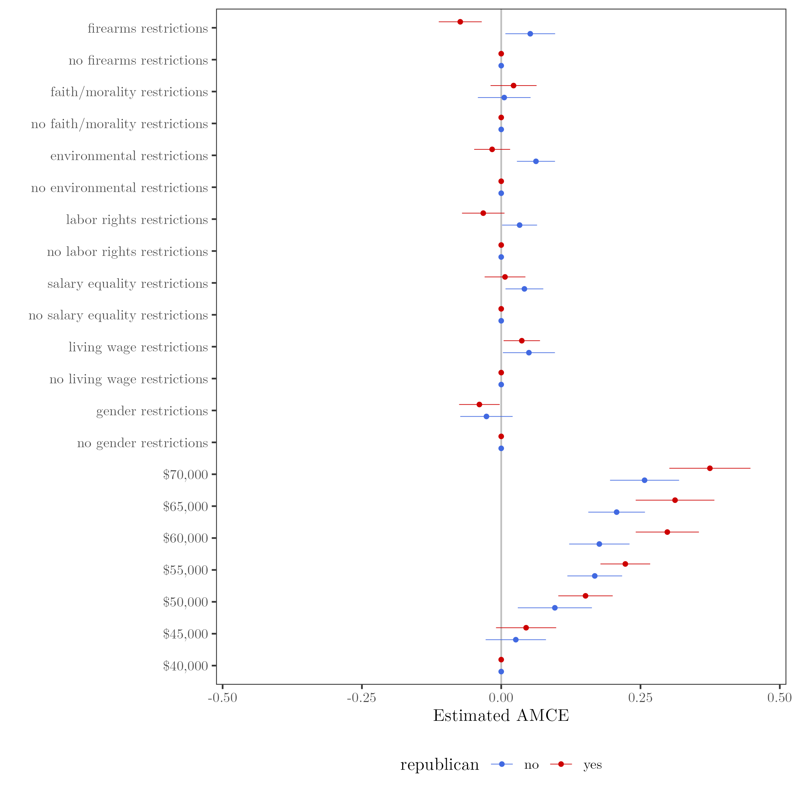

```{r include=FALSE}
library(tidyverse)
```

# Introduction

In recent years, Environmental, Social, and Governance (ESG) investing has emerged as a pivotal aspect of modern financial management, sparking debates that straddle the domains of economics, ethics, and politics. ESG investing, fundamentally, involves the integration of environmental, social, and governance considerations into investment decisions, a practice born from the growing recognition of how these factors can significantly impact financial performance and societal wellbeing [see, e.g., @edmans2023]. With trillions of dollars under management globally, ESG investments have become a major force in the financial world, reshaping how institutions and individuals approach investing.

The ascent of ESG investing has not been without controversy, particularly in the realm of U.S. politics. The concept has become highly politicized, with entities like BlackRock and other major financial players finding themselves at the center of a heated debate [@moynihan2022]. This politicization is vividly reflected in the legislative actions taken by several U.S. states regarding the management of their state pension funds. These legislative efforts are split along ideological lines, with some states endorsing ESG investments under the belief that they align with the preferences and best interests of their constituents, while others vehemently oppose such strategies, arguing that they represent a breach of the fund managers' duty of loyalty to their beneficiaries.

This dichotomy raises an essential but underexplored question: How representative is the ESG-related legislation of the actual preferences and interests of the stakeholders in these state pension funds? Despite the growing body of literature on ESG investing, there exists a notable gap in empirical evidence regarding the representativeness of such legislative actions. This article aims to address this shortfall by juxtaposing these legislative trends against the actual preferences and interests of the stakeholders involved. Through this examination, the paper endeavors to shed light on the alignment---or lack thereof---between political actions and constituent interests in the arena of ESG investing, offering insights that are crucial for policymakers, investors, and scholars in understanding the complex interplay between finance, governance, and societal values.

In pursuit of a comprehensive understanding of the alignment between ESG-related legislative actions and stakeholder preferences, this study employs a powerful research methodology: conjoint analysis. This innovative approach allows us to delve deep into the stakeholders' preferences regarding pension fund investment strategies. Participants in this study engaged in a series of forced-choice decisions, where they had to make selections between different investment options, each characterized by unique attributes related to financial returns and ESG considerations. The methodology's advantage lies in its ability to simulate real-world trade-offs, decomposing the value of complex products with several attributes, and minimize social desirability bias [@bansak2021]. Two separate conjoint experiments provide robust insights into the preferences of American retirement fund participants.

The conjoint experiments paint a revealing picture of stakeholder preferences in the context of ESG investing. Even among individuals identifying as conservatives, there is a demonstrated willingness to sacrifice potential profits to support companies that combat child labor and advocate for gender pay equality. However, when social issues are presented indirectly, conservative participants tend to place a higher emphasis on profitability. These nuanced preferences highlight the complexity of the ESG landscape and suggest that misconceptions about ESG investing and the non-saliency of certain social externalities may serve as the basis of support of anti-ESG legislation efforts.

This Article is structured as follows: Section 2 provides background information on fiduciary duties, public pensions management, and the politicization of ESG investing. Section 3 discusses the methodology. It explains what conjoint experiments are, how the data was collected, and what estimands are relevant for the present analysis. Section 4 presents the results. ... Section 5 discusses the results and puts them into the context of related studies. Section 6 concludes. It argues that the heterogeneity and complexity of public retirement funds participants demands a more flexible supply of plans that better allow aligning the participants' values with their investments.

# Fiduciary Duties and The Politicization of Public Pensions Management

The relationship between pension fund beneficiaries and their managers is underpinned by a fiduciary duty, where the latter are expected to act in the best interests of the former [@schanzenbach2018]. Historically, the primary duty of pension fund managers was to maximize financial returns. However, the emergence of ESG concerns, including climate change and social inequality, led to a reevaluation of what constitutes prudent investment strategies. While ESG concerns may well be understood as risk-management [@edmans2023], ESG's evolution reflects a broader shift in the understanding and application of fiduciary responsibilities in the context of global challenges and stakeholder expectations [@hart].

This change in perspective began to manifest in state-level legislation, particularly in states known for progressive policies. California and New York, for instance, became frontrunners in integrating ESG criteria into their public pension funds. This was seen as aligning with the long-term financial interests of beneficiaries and addressing emerging risks and opportunities related to ESG issues [@rives2023].

However, some states approached the incorporation of ESG factors with skepticism. They viewed the focus on ESG as potentially diverging from the core fiduciary duty of financial maximization []. This led to legislative actions that limited or prohibited the consideration of ESG factors in pension fund investments. These states argued that incorporating ESG considerations might be influenced more by political or ideological beliefs than financial prudence, potentially compromising pension fund performance. For example, states like Texas and Florida enacted legislation that restricts the integration of ESG factors into pension fund investments. These laws reflect concerns about the potential for ESG considerations to prioritize non-financial objectives over the fiduciary duty to maximize returns. Figure \@ref(fig:mapplot) below shows a summary of ESG-related legislation passed until 2023.

This disparate regulatory environment, ranging from proactive ESG integration to outright restriction, mirrors the wider societal debate about the role of ESG factors in investment decision-making. A critical aspect yet to be fully explored is the actual preferences of fund beneficiaries for ESG-aligned investment options. Existing literature has touched upon investor attitudes towards ESG investments, but comprehensive evidence that maps these attitudes across the broader U.S. population remains sparse [@hirst2021]. This gap points to a need for a more detailed understanding of the public's perception and valuation of ESG considerations in their investment choices.

In response to this landscape, this study makes a significant contribution to the U.S. literature on ESG investing. By employing conjoint analysis and utilizing a large sample that aims to represent the diverse U.S. population, the study offers a more granular view of how beneficiaries balance ESG factors with other investment considerations.

```{r message=FALSE, warning=FALSE, include=FALSE}
library(ggplot2)
library(usmap)
library(extrafont)

extrafont::loadfonts(quiet = TRUE) 

# Load the fonts into R (only needed once after installation)
font_import()
loadfonts(device = "pdf")  # For Mac, use for PDF output

# ESG data
esg_data <- data.frame(
  state = tolower(c("az", "ar", "ca", "co", "ct", 
                    "fl", "ga", "hi", "id", "il", 
                    "in", "ia", "ks", "ky", "la", 
                    "me", "md", "ma", "mi", "mn", "ms", "tx")),
  legislation = c("Neutral/Other", "Anti-ESG", "Pro-ESG", "Mixed", "Pro-ESG", 
                  "Anti-ESG", "Neutral/Other", "Pro-ESG", "Anti-ESG", "Pro-ESG", 
                  "Anti-ESG", "Neutral/Other", "Anti-ESG", "Anti-ESG", "Neutral/Other", 
                  "Pro-ESG", "Pro-ESG", "Pro-ESG", "Neutral/Other", "Neutral/Other", "Anti-ESG", "Anti-ESG"))

# Plot the map
mapplot = plot_usmap(data = esg_data, values = "legislation") +
  scale_fill_manual(values = c("Anti-ESG" = "red4", "Pro-ESG" = "blue4", 
                               "Neutral/Other" = "lightgrey", "Mixed" = "darkorange3"), 
                    name = "Legislation Type") +
  theme_void() +
  theme(text = element_text(family = "CMU Serif"),
        axis.text = element_blank(), 
        axis.title = element_blank(), 
        axis.ticks = element_blank()) +
  labs(#title = "ESG Legislation in US States (2023)", 
       #subtitle = "Categorization based on Ropes & Gray report",
       caption = "Data Source: Ropes & Gray report")

```

```{r mapplot, echo=FALSE, fig.align="center", fig.cap="ESG Legislation in US States (2023)", out.width='0.8\\textwidth'}
mapplot
```

# Methods

## Conjoint Analysis

Since the early seventies, the term "conjoint analysis" has primarily been used to refer to a class of survey-experimental methods that estimate respondents' preferences based on their overall evaluations of alternative profiles that vary across multiple attributes [@bansak2021]. The general idea behind conjoint analysis is that *features* or *attributes* embodied in objects or people drive consumers' preferences for that product. Features or attributes are product or people's characteristics, such as the screen size of a tablet, its memory, and battery life; or a candidate's education, work-experience, gender, among others.

The notion that product-specific attributes lead people to prefer an option over another is consistent with economic and consumer-behavior utility maximization theories [@ben-akiva2019]. For instance, two job opportunities usually involve different salaries, commute times, and benefits packages. Since there is more than one variable---or "dimension"---to consider when choosing what job offer to accept, such a choice is *multidimensional*. Conjoint analysis allows for estimating the relative importance of each attribute or feature on people's decision making. In the example above, it allows determining how important each of the attributes (i.e., salary, commute time, and benefit package) is for job applicants, and how changes in attribute levels affect the probability of accepting an offer.

Conjoint analysis can take many forms but in any of them the study participants compare at least two options presented to them. Each comparison is a "choice-set," and each participant makes several choices per study. The two most common forms of conjoint experiments are rating-based and choice-based surveys. The former asks the study participants to rank each option presented to them. The latter, to choose the option they prefer in each choice-set. The method infers people's preferences from the *profiles* (i.e., options available to choose with randomly assigned levels of each attribute) people choose and/or rank.

In addition to controlling for several potential confounders at once, conjoint experiments are better at minimizing social-desirability bias. Because multiple features are changing at the same time, the task does not force the respondent to focus on a single feature. By avoiding such a focus, conjoint analysis reduces the possibility of induced demand artifacts. A multifeature conjoint analysis task is more likely to be reliable and valid than a contingent valuation task in which the consumer trades off only one feature and price.

## Study Design

This work is based on two forced-choice conjoint experiments. Each participant first read the survey instructions, which summarized how investment funds may promote environmental and social causes and described the *attributes* included in the conjoint vignettes. The questionnaires started with socio-demographic questions and both surveys included two attention checks. Subsequently, each participant saw the conjoint vignettes. In both experiments each participant had to make 12 choices and select one of two *profiles*. The second experiment included an additional part between the socio-demographic questions and the conjoint vignettes, which intended to measure general preferences for different combinations of investment packages that included only one ESG attribute. This was to have a benchmark to compare market share simulations. Figures \@ref(fig:cj1) and \@ref(fig:cj2) show how the conjoint vignettes looked in the first and second experiments, respectively.

The following were the attributes of the conjoint vignettes in the first experiment: (i) expected pension (from \$20,000/year to \$60,000/year, by \$5,000 increments), and the following types of investment restrictions: (ii) companies that sell firearms, (iii) entities that profit from fossil fuels, (iv) firms that may employ children, (v) companies that advocate for racial diversity in management, and (vi) firms that advocate for equal pay between men and women. There were no randomization constraints, which made 256 combinations (i.e., profiles) possible ($8 \times 2^5$).

The second experiment had different variables and levels for the expected pension attribute (7 levels, from \$40,000/year to \$70,000/year with \$5,000 increments). The rest of the variables were the following investment restrictions: (i) companies with a low proportion of women in executive positions, (ii) firms that pay a living wage, (iii) companies with the highest pay disparity between the executives and the median employee, (iv) companies that comply with the UN standards for labor rights, (v) entities that produce products with a negative environmental impact, (vi) firms that profit from adult entertainment, alcohol, tobacco, or gambling, and (vii) companies that sell firearms. Each of these variables had two levels (i.e., present or absent). Thus, there were 896 possible combinations ($7 \times 2^7$). The main reason for the variables change was to compare the results with those of a related study [@hirst2021].

```{r cj1, echo=FALSE, fig.align="center", fig.cap="Conjoint Vignette First Experiment"}

```

```{r cj2, echo=FALSE, fig.align="center", fig.cap="Conjoint Vignette Second Experiment"}
knitr::include_graphics("cj2.png")
```

## Sample

The survey distribution was facilitated by Lucid Theorem, leveraging its expansive network to target a diverse respondent pool. This effort aimed to obtain a representative sample of the U.S. population, with particular emphasis on achieving a balanced representation in terms of gender and age demographics. The conjoint analysis questionnaire was hosted on the Conjointly.ly platform, renowned for its intuitive user interface that enhances participant engagement and simplifies the programming of conjoint experiments. An integral feature of the Conjointly.ly system is its automatic filtration mechanism, which screens out responses from individuals demonstrating low levels of engagement with the survey. Adhering to stringent quality control measures, only responses from participants who successfully cleared two attention checks were considered valid. Nonetheless, responses completed in less than half or above twice the median completion time were filtered. Consequently, the first experiment comprised 2,389 participants, while the second experiment included 1,338 participants.

[update after filtering \>0.5 median or \<2median]

gender quick descriptive stats. age, education, income, average completion time... use of weights

## Estimands of Interest

### Average Marginal Components Effect

One of the most widely used estimands in conjoint analysis is the average marginal component effect (AMCE) [@hainmueller2014]. It measures how an attribute change affects the probability of choosing an option (e.g., good, service, candidate, etc). Going back to the job offers example, if a researcher wants to determine how commute times (let's assume there are only two levels: "high" or "low") affect the probability that job candidates accept an offer, the AMCE algorithm will group all the profiles in which commute time was "high" and all the profiles in which commute time was "low." The difference in outcomes (i.e., offers accepted) between the two groups is the AMCE.[^1]

[^1]: Formally, the AMCE can be expressed as follows:$$AMCE = \frac{1}{N} \sum_{i=1}^{N} (E[Y|X_i=x_i, \text{all other covariates}] - E[Y|X_i=x_0, \text{all other covariates}])$$

    Where: $N$ represents the number of observations or cases, $Y$ denotes the dependent variable of interest, $X_i$ represents the categorical independent variable with attribute levels $x_i$, $x_i$ and $x_0$ are different levels of the independent variable, $E[Y|X_i=x_i, \text{all other covariates}]$ is the expected value of the dependent variable when $X_i$ is at level $x_i$, while keeping all other covariates constant, and $E[Y|X_i=x_0, \text{all other covariates}]$ is the expected value of the dependent variable when $X_i$ is at level $x_0$, while keeping all other covariates constant.

In more technical terms, the AMCE is a difference between "marginal means" [@leeper2020]. It represents the causal effect of changing one attribute of a profile while averaging over the distribution of the remaining profile attributes. This method simplifies the interpretation of the multifaceted choice data by quantifying the impact of each attribute on the likelihood of a scenario being chosen. Its simplicity made it one of the most widely used estimands in experimental political science [@bansak2021] to measure, for instance, whether people's ethnicity affects the probability they get a visa, or whether candidates from minority groups are less likely to be elected for office.

A particular advantage of this estimand is its straightforward graphical representation, especially when comparing two groups of respondents. This is one of the reasons why this study mostly reports AMCEs.

### Multinomial Logit

The Multinomial Logit (MNL) model is rooted in the concept of Random Utility Maximization (RUM) [@ben-akiva1985]. When comparing two products, rational consumers will choose the option that provides them with the highest utility. According to this framework, utility is modeled as having an observed component due to the variation of product features and an unobserved component due to the impact of unobserved variables:

$$
U_{ij} = X_{ij} + \epsilon_{ij}
$$

where $U_{ij}$ represents the total utility that individual $i$ associates with alternative $j$, $X_{ij}$ is the systematic component of utility (a vector of explanatory variables), and $\epsilon_{ij}$ is a random error term that captures the unobservable or stochastic component of utility, which is assumed to be identically and independently distributed (IID).

The observed utility $X_{ij}$ is the sum of the partial contributions of each feature and price. A "partworth" is the partial contribution of a level of a feature (e.g., the difference in utility of buying a tablet with 256 vs 128gb of storage). In the utility function $U_{ij}$, for individual $i$ choosing option $j$, partworths are included as follows:

$$
U_{ij} = \sum_{m=1}^M \beta_{m} X_{ijm} + \epsilon_{ij}
$$

where $\beta_{m}$ represents the partworths or utility coefficients for each attribute level $m$, $X_{ijm}$ is a variable indicating the presence (or level) of attribute $m$ in choice $j$ for individual $i$, and $M$ is the total number of attributes or attribute levels.

MNL estimates these partworths from the respondents' choices. This calculation is typically done through Maximum Likelihood Estimation (MLE). The likelihood function in MNL is based on the probability that the observed choices are made given the utility model. The MLE process finds the values of $\beta m$ that maximize the likelihood of observing the choices made by all respondents in the sample. After calculating the value of each attribute, the model predicts the probability that individuals choose an option within the choice set as a function of its features. The probability $P_{ij}$ of individual $i$ choosing option $j$ in the MNL model is given by a ratio of exponentiated utilities:

$$
P_{ij} = \frac{e^{\sum_{m=1}^M \beta_{m} X_{ijm}}}{\sum_{k=1}^J e^{\sum_{m=1}^M \beta_{m} X_{ikm}}}
$$

Unlike AMCEs, which provide average causal effects, multinomial logistic models can capture more complex interactions between attributes and provide insights into the probability distributions of different choices. As the formula above clearly illustrates, the MNL output is a set of choice probabilities, which is based on the relative preferences for different levels of the product features. MNL assumes that preferences or partworths are homogeneous across all individuals. In other words, it does not account for variation in preferences between different decision-makers. However, interaction MNL models do account for observable heterogeneity, and two notable extensions of MNL, the Mixed Multinomial Logit (MMNL) [@mcfadden2000] and Hierarchical Bayes (HB) [@allenby2006], allow estimating partworths for each respondent, which is particularly useful for analyzing cases in which people have heterogeneous preferences and calculating hypothetical market shares of different profiles.

Given the relative simplicity of MNL compared to its alternatives and that the main source of respondents' heterogeneity is likely to be captured by the participants' political identity, which is properly coded, MNL interaction models will be preferred in this study. However, simulated market shares will complement the analysis to assess the representativeness of ESG-related public pension legislation. In this respect, while AMCEs report the causal effect of a change in an attribute level (e.g., investment restrictions that support companies that pay living wages) considering the distribution of profiles, MNL and related models allow calculating probabilities of choice, considering different combinations of attribute levels (e.g., \$40,000 pension with all possible ESG restrictions vs a \$45,000 pension with fewer ESG restrictions).

# Results

## General preference for social sustainability

When considering AMCEs for the population as a whole, we find that the respondents had a very strong preference for funds that took affirmative measures against child labor ($AMCE = 0.26, \space s.e. = 0.02, \space p < .001$), favored gender pay parity ($AMCE = 0.14, \space s.e. = 0.01, \space p < .001$), and advocated for racial diversity in management ($AMCE = 0.1, \space s.e. =0.02, \space p < .001$). Figure \@ref(fig:amce1cjmain) shows these results, which represent the main findings of the first conjoint experiment. In the second experiment, the effect sizes were smaller.The participants showed a general preference for funds that ensured firms paid a living wage ($AMCE = 0.05, \space s.e. = 0.015, \space p < .004$), excluded companies with a large wage disparity between management and the median employee ($AMCE = 0.025, \space s.e. = 0.013, \space p <0.05$), and banned firms whose products had a negative environmental impact ($AMCE = 0.03, \space s.e. = 0.012, \space p < .017$). Figure \@ref(fig:amce2cjmain) displays these results.

````{=tex}
\begin{landscape}

```{r amce1cjmain, echo=FALSE,  message=FALSE, warning=FALSE, fig.align="center", fig.cap="AMCE First Experiment"}



```
\end{landscape}
````

````{=tex}
\begin{landscape}

```{r amce2cjmain, echo=FALSE,  message=FALSE, warning=FALSE, fig.align="center", fig.cap="AMCE Second Experiment"}


```

\end{landscape}
````

***MNL model. Summarize main findings. Include tables in the appendix***

## Consensus about child labor, gender pay gap, and living wage

Not surprisingly, there is substantial heterogeneity among liberal and conservative respondents. When comparing the responses of those that identify as republicans with those that do not (independents plus democrats), it is clear that republicans are less likely to choose funds that exclude fossil fuels ($\Delta AMCE = -0.16, \space s.e. = 0.026, \space p <.001$) or firearms ($\Delta AMCE = -0.08, \space s.e. = 0.020, \space p<.001$) (see Figures \@ref(fig:amce1byr) and \@ref(fig:amce2byr) below. This finding is not surprising. However, people from all over the political spectrum tend to favor funds that advocate for gender pay parity and take affirmative measures to prevent child labor. While republicans are indifferent to the pursuit of racial diversity in management, independents and democrats tend to favor said goal. One of the main aims of the first experiment was to assess whether people in Florida were more conservative than average. Interestingly, there were no statistically significant differences between Florida and the American average. If anything, people in Florida appeared to care more about child labor than average. But the difference did not pass a significance test.

```{r amce1byr, echo=FALSE,  message=FALSE, warning=FALSE, fig.align="center", fig.cap="AMCE First Experiment by Ideology"}

```

```{r amce2byr, echo=FALSE,  message=FALSE, warning=FALSE, fig.align="center", fig.cap="AMCE Second Experiment by Ideology"}

```

***MNL model. Summarize main findings. Include tables in the appendix***

## The framing and saliency of social features has a large effect on people's profit maximizing drive

Perhaps the main finding of the first experiment was the very substantial effect of the child labor feature on most respondents. The effect was so large, that it compromises the reliability of the first experiment's WTP estimates [see, e.g., @dieckmann2009]. Child labor is one of many variables the UN includes as a part of its international labor rights standards. This was properly disclosed to the participants when defining each attribute of the conjoint vignette in the introduction of the second experiment. While most of the respondents did prefer options that excluded companies that did not meet the UN labor rights standards, the effect was much lower compared to funds that did not take measures against child labor. Notably, the effect was negative---but not statistically significant---for Republicans.

The psychology literature has documented that people are more likely to act ethically when a decision cue increases the saliency of a choice's moral dimension, which is consistent with a self-concept maintenance theory [see, e.g., @mazar2008]. It is likely that a similar effect occurred in the first experiment, in which the child labor feature had such large effect. In fact, in some of the open-ended comments, many participants refereed to child labor as a case in which children autonomy is coerced. Moreover, there was a notable difference between the results of the first and the second experiments. While investment exclusions affecting "fossil fuels" split the respondents in partisan lines, exclusions that focused on the "environmental impact" of companies did not affect the decisions of Republicans. The impact of policy framing on policy popularity is well-documented [see, e.g., @hardisty2010]. This appears to be a similar case in which the "fossil fuel" label acts as a stronger cue for Republicans. Nonetheless, the sample of the second experiment was much smaller than those of the first experiment. Future research may well test this hypothesis with a larger sample size.

**Complement analysis with WTP MXL Models**

## Misconceptions about the meaning of ESG appear to drive anti-ESG legislation

One of the first questions the participants saw in both questionnaires was whether they would prefer their pension funds be managed according to ESG considerations. Conditional on their answers, respondents were categorized as either having a "pro" or "anti" ESG prior.

It is evident in both experiments that people with an anti-ESG prior either opposed or were indifferent to environmental features. However, they did support some social causes. In the first experiment, those with an anti-ESG prior supported every cause but exclusions of firearms and fossil fuels, which did not have a meaningful impact on their decision making. In the second experiment, they were indifferent to every single possible restriction. (check with MLM)

## Religiosity makes conservatives more conservative

## Age, income, religion

# Discussion

-   choice analysis is complex and models are not as interpretable as typical OLS models, but report different results and also appreciate the use of different methods to find sensible findings by triangulating different studies

-   non-compensatory DM. Interpret first conjoint with caution. Check with statistician [pretesting: no child labor up to a point \~ lowest pension levels]

-   religiosity just people more conservative. Different effect some have found in Europe

-   saliency and "fair trade"

# Conclusions

# References

# Appendix
